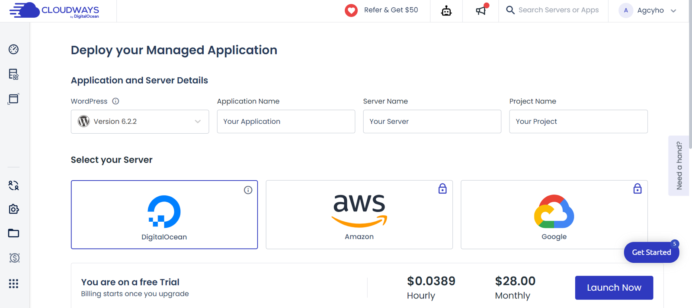
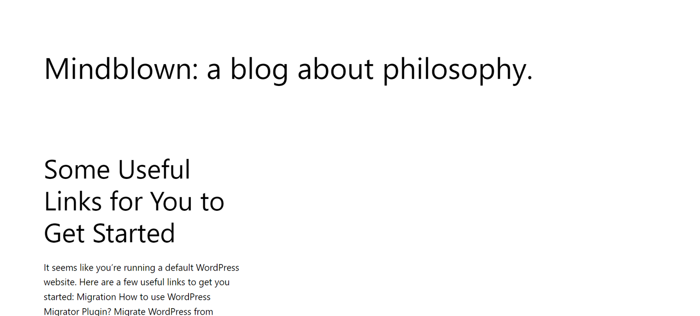

### 用不到一週寫什麼心得
說是這樣說啦，但凡走過必留下痕跡嘛。  
雖然用不到一週，但我每天下班可是搞這玩意兒搞到凌晨才睡覺，也能說是稍有心得啦。  
所以就稍微寫篇小教學 + 吐槽心得文:smirk:。
{/* truncate */}
## Why wordpress
最開始選擇 wordpress 的理由很簡單：
1. 打從我還在用 Blogger 就聽過 wordpress 的大名。
2. 想用用看這個號稱全世界有 40% 網站使用的內容管理系統到底有多厲害。
3. 104 有職缺是專門架 wordpress 網站的，身為一個前端工程師怎麼能不玩玩看。

所以你看，理由很簡單吧，所以我在某個週六，就給他魔法小卡刷下去開始架站了。

## wordpress 快速小教學
wordpress 是一個成熟到你隨便在網路上 google，就可以找到一籮筐教學文和主機折扣的東東。  
我有時都搞不懂他們到底是真心推薦還是推薦成功的回扣真的很多...:confused:。

其實現在架 wordpress 真的很簡單，按我自己體驗了一輪下來，所有東西只要花錢，自然廠商幫你辦好好的。  
做一個基本的 wordpress 網站，你只需要買個`網址` (如果不是那麼在乎個人品牌，那你甚至可以不用買)，然後找個你滿意的主機商，魔法小卡給他刷下去，以目前大家最常聽到的那幾家主機商 Cloudways、A2 Hosting、Bluehost 而言，他們會直接幫你把 wordpress 架好好的，你只需要做少量的設定。甚至可以說，在你把卡卡刷下去時，就完成 80% 的網站建置了。

以我個人而言，我的架站步驟如下：
1. 先去 [Cloudways](https://www.cloudways.com/en/?id=681130) 租了一個主機 (對，我直接選擇最潮的 VPS 主機)。  
Cloudways 的 UX 做得極好，彷彿生怕多一個步驟你就會不想架站一樣，當點擊了 `Start Free` 之後，後面就是照著步驟來的的事了。  
基本上，全部做完，你就得到一個 wordpress 後台和網站了。

:::warning
Cloudways 提供三天免費，但還是建議先去設定信用卡，以免你之後很愛它，決定繼續用下去，結果三天到了扣不了款，所有東西一夕之間化為烏有。
:::
2. 在 [ganti.net](https://www.gandi.net/zh-Hant) 買了一個網址，對，就是現在這個部落格的網址。
3. 然後在 ganti 中去設定網址的 `A record` 跟 `CNAME`。  
A record 是 Cloudways 會給的網域，CNAME 找到名稱為 `www` 的點進去，把值修改為 `@` 即可。
4. 回到 Cloudways，去 `Domain Management` 把買的網址設定進去即可。
5. 同樣在 Cloudways，點擊 `SSL Certificate`，添加`你的網址`跟`www.你的網址`，即可完成 SSL 憑證申請。
:::tip
在 Cloudways 中，基本上 Domain Management 跟 SSL Certificate 都只有在一開始架站時會進去。  
其他如 wordpress 後台、wordpress 帳密、IP 位置，都在 `Access Details`。
:::
基本上，上述步驟都完成，你就能擁有一個 wordpress 部落格了！

## 你以為成本只有架站？
到現在有一個很陽春的 wordpress 網站出現，可以來算一下一年的成本大概是多少。  
1. 網址：我直接買兩年，付了約 1000，相當於一年 500。
2. Cloudways 主機：最便宜的方案一個月 14 美，相當於一年 5000 台幣。
歐給，所以截至目前為止一年約 5500 台幣。  
當然，你也可以不要用 VPS 主機，一個月的成本可以變成一半甚至更低。

**但是其實架完站之後，如何設計網站才是真正的坑！**

相信大家如果查過 wordpress，都會有一堆文章跟你說它是一個`不用寫 code，就可以產生漂亮網站的軟體` (前端哭暈在廁所)。  
不用寫 code 這句是對的，你可以利用 wordpress 內建的編輯器以及許多免費的模板做出一個有 header、footer、側欄...等的網頁，看似應有盡有，但那個版型實在一言難盡，充滿了時代的韻味。

所以開始會想套那些很漂亮的模板，甚至是使用大家都很推薦的 [`Elementor Pro`](https://elementor.com/)，然後魔法小卡一刷，燈愣，一年 59 美元，至此一年成本提高到約 7000 台幣了。更有趣的是，都花 59 美了，它還不讓你客製 CSS，要客製？繼續升級吧！

雖然東拉拉、西拉拉就能跑出一個不錯看的網站這點挺不錯的，但你看，光是走到這一步就要一年 7000 台幣了，如果你是一個稍微會些 HTML 和 CSS 語法，或是甚至你跟我一樣本身是網頁開發者，想追求更高的網頁自由度與掌控度，那就只能繼續提高成本。(說要去更改 wordpress 的 pHp 檔案就沒必要了...)

所以基本上，wordpress 各種便利的功能或套件很多都建立在金錢上，我不知道在哪裡看過，有人稱這個是必要之痛。Well...，也許是吧，但顯然如果你只是需求一個部落格，有其他選擇可能更適合你，比如 `Hexo` 或 `Docusaurus`，當然，這些會比較希望你稍微了解一點點程式語言以及 Git，也就是金錢成本變成了知識成本，但其實現在 google 一下也超多面向非工程師的教學文。

## 最後小心得
其實無論是 wordpress 架站還是 docusaurus 架站都有好有壞啦。像我選擇使用 docusaurus 無非是使用習慣偏工程師，而且我可以用 GitHub 幫忙儲存文章。

但相對的，如果你不會寫 code、也不想稍微了解一下，那花錢玩一下 wordpress 也可以達到一樣的效果，你就不必花時間去在一些莫名其妙的地方上 debug。

所以說，選擇 wordpress 還是其他的架站方式，都只是選擇的差異。  
不得不說，wordpress 很多功能真的很方便，比如電商。比起自己串金流 API 跟架資料庫簡直不要說太方便。但是這很多的一切都是建立在肯不肯花那些錢去買工程師做出來的商品。

好啦，小小心得，也是把這個網站的來源始末交代清楚了，大家聖誕快樂！