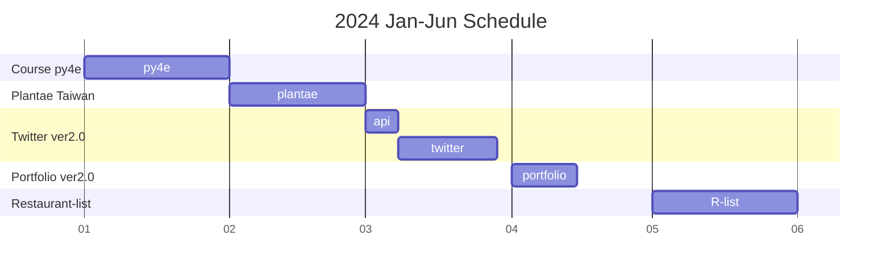
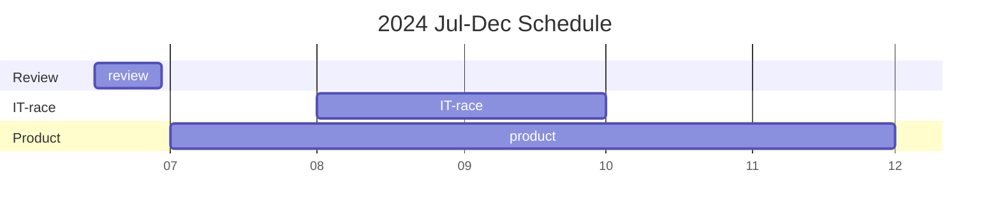

想不到標題要打什麼就一概用 Hello 開頭:relieved:。  
過往到了元旦都會發一篇文在 FB 上，做為新年的招呼與期待 (喔，2023 年貌似沒寫...)。  
今年有自己專屬的部落格了，當然就是要寫在部落格囉 ~。

回首 2023，不能說波瀾壯闊，至少也能說是我人生大轉折的一年。閉關了 8 個月，在 2023 年底在職涯上來了個超級大轉彎，這個彎大概比秋名山的彎道還彎。  
2024，新的一年，不論在哪方面都是走在一條嶄新的道路上，是該好好安排一下未來這一年的`待辦清單`，希望在咻地去到 2025 後回首這份清單是能對自己滿意的。

> 每天自我成長 1%，一年以後會變成現在的 37 倍強大。
{/* truncate */}
### 2023 短回顧
回顧我的 2023 其實真的過得很快，時間軸拉開，在過完 228 連假直接光速從統一離職投入 ALPHA Camp 全職學習拼轉職。在 11 月進入現在的公司正式成為一名前端工程師，正式邁入軟體開發這一領域，滿打滿算，今天剛好是我正式成為前端工程師的第二個月。

說實在話，我也不知道 2023 年做這個決定到底對於我的人生來說究竟是對還是錯。畢竟以現實面來說，撇除那些資工本科的，我一個浸淫在軟體界已久的表姊夫曾經問我：「現在也有那麼多職科的在做網頁開發，你的優勢在哪？」，他建議我的方向是像我的同學們一樣成為一名數據工程師。

唉，這個疑慮我也時常問自己，在開發畢業專案 Simple Twitter 時也時常跟轉職的同學一同憂心忡忡地討論，不用說那些高職專科了，現在隨便 google 一下，六角學院、ALPHA Camp、五倍紅寶石、資策會...有太多的資源，可見有多少人是像我一樣擠破頭想要進來這個領域，所以這個領域真的那麼好嗎？  
關於這個問題的答案是我不知道。我現在工作的薪水實際上算起來是比我前一份低的，但我希冀著總有一天能像網路上那些前端大神，把年薪百萬當作前端職涯的開始。

我始終提醒著自己，2022 年底我是多麼的不快樂，在一份已經可以預見五年後生活樣子的公司上班，我為何不趁還未滿 30 歲拚搏一波換個專業與領域衝刺呢？  
雖然不知道實際上自己在網頁開發、軟體開發這個領域在時間軸拉長後的體會如何，但總之，前一份已經那麼不開心了，現在總不會比之前更不開心吧？

### 2024 新目標
先把瑣碎的小目標講完：  
1. 可以的話，交個女友:flushed:。
2. 寫小說、寫小說、寫小說，很重要所以說三次！
3. 不能再偷懶，要多看點書了。
4. 聽說英文很重要，我也知道英文很重要，好吧，先列出來:stuck_out_tongue_closed_eyes:。

接下來是職涯的安排，也算是在專業上的自我學習安排，這個部份我大概 11 月就開始想了，有些也正在付諸行動中：
1. Python for Everybody 的課把它上完，目前進度 3/5，`預計 1 月完成`。
2. 兌現承諾，做出植宇宙的展示網站與購物商場 (現在進度應該有 1/5)，`3 月得交差`，所以預計 2 月做吧。
3. 重構社群網站 Simple Twitter 專案，目前不確定會用什麼方式做，可能 Nuxt 也可能 Next 吧，但會包括連 API 都自己寫。先`預計 2 月或 3 月`開始吧。(可能會把原本預計要做的 web-socket 專案一同併進來)。
4. 做一個個人作品集網站，大概 `4 月` 完成。
5. `8 月和 9 月`，想參加 IT 鐵人賽，但主題目前沒想法。
6. 鑒於公司的姐姐 2024 不幹訂餐這件事了，我有感而發，預計來做一個餐廳清單 + 訂購統計網站，這件事就排在哪天我做完作品集網站之後吧。
7. 私人微平台的建立。這是一個某天突然迸出的 idea，我也很難用一小段文字描述它，等它出來的時候大家就知道了。但它要用的技術我估計之下有些我還不會，所以時程未定。

在課程方面，2024 有幾門想上的課：
1. [Meta Back-End Developer](https://www.coursera.org/professional-certificates/meta-back-end-developer)：這是用 Python 和 Django 寫後端的課。
2. [Google Cybersecurity](https://www.coursera.org/professional-certificates/google-cybersecurity)：嗯，網路安全很重要。

目前大概就是這樣，好像就已經很多了:confounded:。  
大部分都是為了職涯準備的啦，沒辦法，我也怕被 AI 淘汰啊:weary:。  
總而言之，2024 拚拚看囉！

最後，分享一首剛剛聽到的歌，頗勵志，就作為 2024 開端吧！

<iframe width="560" height="315" src="https://www.youtube.com/embed/JWYNptUogU8?si=z6ilmErO5JcZG0SO" title="YouTube video player" frameborder="0" allow="accelerometer; autoplay; clipboard-write; encrypted-media; gyroscope; picture-in-picture; web-share" allowfullscreen></iframe>
