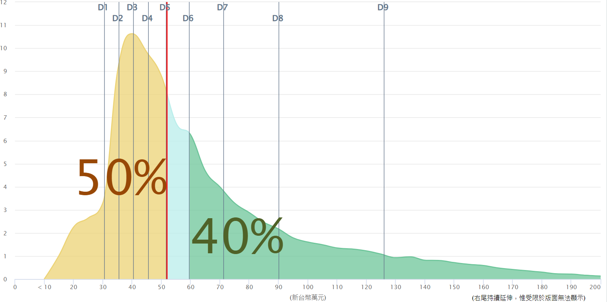

吳淡如的這本 `人生實用商學院 - 富有是一種選擇`，沒有教你如何看線圖、沒有教你如何跑短線，雖然裡面稍微還是有些理財名詞，但這也是無可避免的。  
在這本書裡，吳淡如更喜歡用那種過去到現在，乃至未來都有用的`原則`來教大家如何理財，那是她的學習所得、身邊人的經歷、或是根本就是自己的經歷，但總之，人生實用商學院中，吳淡如已經用最簡單的方式告訴我們如何理財。

{/* truncate */}
## 基本原則就是抗通膨
這是一個大通膨時代，你我都有感覺，現在的幣值跟爸媽那時代大相逕庭。  
在台灣，111 年受雇群眾的薪資中位數落在年薪 51.8 萬元，換算月薪大概是 4.3 萬元。 (見下圖，來自行政院主計總處)

誒好，現在年輕人大學剛畢業，除非你剛好就是那些天選科系，一畢業就進入科技大廠、外商、醫生，不然新鮮人通常也都領不到這個價格，甚至我有一些工作幾年的朋友現在也還在 3 開頭。唉，一直漲的物價，但不見漲的薪資。

台灣的 CPI (不嚴謹地說就是通膨率) 在去年落在 2.24%，而台灣公告的活期存款利率或活期儲蓄存款利率是 0.58% 跟 0.7%，瞧，薪資已經不怎麼漲了，若還把錢傻傻地全部存銀行，等著被通膨幹掉吧！

所以理財的最基本的原則就是幹掉通膨！(不是月薪高的人就不用幹掉通膨喔！會賺錢不代表會理財啊！)

### 處方簽：買 ETF!!
如果說通膨是慢性病，我們就該服藥抵抗它，ETF 會是一個好選擇！  
先說，以下沒有任何推銷宣傳:confounded:

為什麼說 ETF 是個好選擇，下面有幾個原因：
1. 良好的 ETF 通常殖利率都大於 3，沒有特別高，但足夠對抗通膨。  
(以台灣人最愛買的 0050 或 006208 為例，在 2023 年殖利率 3.08%，在金融市場哩，高於 3% 的 ETF 或股票都算表現優秀。)
2. 良好的 ETF 不會倒，比如 0050 和 006208 就是投資台灣前 50 的公司，總不能台灣前 50 家公司都倒光光吧 :sweat_smile:  
(但這並不是說 ETF 一定不會倒喔！吳淡如書中有寫道有些 ETF 也是倒掉的。)
3. 你大可以偷懶，不要盯盤，`定期定額`買，長期來看，肯定是賺的！  
(定期定額放長期很重要，其實不只吳淡如的書，之前看過一位理財專家計算，在美國過去遇到兩次重大金融危機的 10 年，你如果持有的是放長期的股票，那就都還是賺的，甚至金融海嘯帶來的影響都沒那麼大。)

總而言之，就是需要你把錢從銀行移來一個穩健但可以對抗通膨的地方儲存，這個地方就是 ETF。  
實際上吳淡如並沒有講到績優股，但個人認為，績優股也是對抗通膨可以考慮的選擇，殖利率通常都在 3-5%，但當然風險會稍微高 ETF 一些。

### 醫囑：要有良好習慣與心態！
上面是藥，但不是有一說，病人的心態也會影響病情，所以這裡是醫囑。  
吳淡如的叮嚀也很簡單，總結而言就是要有健康的投資心態與習慣！

大致上是這樣的：
1. 你要先確保自己有足夠的現金流！吳淡如建議你至少要有夠自己活一年的現金！
2. 至少收入的二成記得先留下來不要花掉！
3. 當你賺越多 (包括發現 ETF 或股票有了股利或股息)，不代表你需要通通花掉，代表的是你可以有更多機會去用錢滾錢！所以把股息繼續拿去滾雪球吧！
4. 要有正向的思考、不要怕失敗，並且要一直持續學習！
5. 不要敝帚自珍！這體現在很多地方，在股票上就是人們常常有自己可以幹掉大盤的錯覺，殊不知定期定額的懶人買法才是省時省力又賺錢的最大贏家！  
(好像是綠角的書吧，裡面有段引用華爾街投資經理人的話：`當你覺得自己能操盤時，請想一下對手是我們 (指華爾街經理人)。`)
6. 多買`資產`(能為你帶來更多錢錢的)，少買`耗材`(會逐漸丟失價值的，比如你車庫正停著的車)。

## 下一個目標是無後顧之憂的人生
在幹掉通膨後，理財的下個目標就是讓自己有個無後顧之憂的人生，這裡指的不只是財富自由、不只是養老金，而是指要有一個安穩的`家`。  
所以吳淡如建議大家，如果能力允許，請把`有自己的小窩`給列入計畫。(她舉了一個朋友離婚的例子，很貼切，但我覺得很好笑:grin:)

吳淡如給了大家一些小建議，當然我個人覺得這些技巧不只可以用在買房啦！  
1. 貸款比例 (指還款) 不宜超過收入 1/3。  
但這不是說要全額購買 (現在能全額購買的人大概也不用想這個問題:sweat_smile:)，實際上如果運用得當 (如：低利率時)，適量貸款是能減輕壓力甚至賺錢的。  
(不可思議的是，其實通膨在某些程度也減輕了過去負債的壓力，畢竟幣值變小了。)
2. 先求有，再求好。考量裝潢、建坪數在過去和現在的計算有差異以及一大堆因素，也許你並不需要一開始就買嶄新的房子！

## 小小的結論
好吧，最後來個小結論，其實吳淡如這本書的用意真的很簡單，就是希望指導大家能用最不需要動腦的方式來理財、來過上一個沒那麼有壓力的人生。  
其實很多書都有寫到一個結論，在理財這塊，越不動腦的通常比那些腦筋動很多喜歡各種盯盤的人多。

所以呢，我們要存 ETF 或存股來對抗通膨，這是我們生存下去的第一根本。  
然後，我們要為自己安置一個小窩，而且買房就算不住本身也是一個投資。

當然個人的心態也要正確，我很推薦大家去看吳淡如解釋`錨定效應`和`啤酒效應`那兩章，你會發現自己的判斷和直覺有時根本就不可信:persevere:！

## 書籍資訊
**人生實用商學院 - 富有是一種選擇 / 吳淡如 / 時報出版**