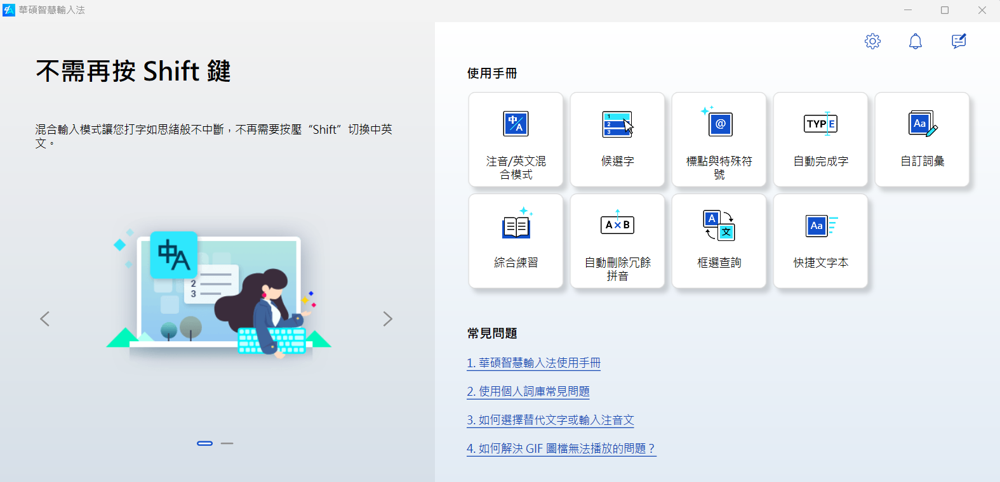

**2024-11-08 更新**  
最近有同事跟我說，我推薦他的[華碩智慧輸入法](https://www.asus.com/tw/content/smartinput/)很方便很好用，嗯，推坑成功 :smirk:  
但說實在的，雖然我現在依舊還在使用華碩智慧輸入法，但那是因為它給予的方便性讓我選擇忽視它其他的缺點。  
它有一些缺點是我這半年多使用下來逐漸察覺的，讓我無法像當初剛寫那篇文章時那樣無腦推它，所以在 2024 年更新一次這篇文章，重新來看看華碩智慧輸入法的優缺點。

{/* truncate */}

華碩智慧輸入法是我在前公司時總工程師在某次開會後向大家分享的輸入法，這個輸入法嘛...最大的優點就是方便，其他部分呢...嗯，我現在會覺得一言難盡。  
先說，想體驗華碩智慧輸入法的人現在可以在微軟商店上下載到，安裝就可以使用了。至於 Mac 的用戶，我不知道華碩智慧輸入法究竟有沒有支援 Mac 或是有沒有其他替代的輸入法。  

那正題開始，我們來說說華碩智慧輸入法的優缺點：
1. 優點：
   - **最聰明的中英混合輸入法**：這是華碩官網自己說的，會自己判斷你正在打的詞彙究竟是英文還是中文，我猜這跟鍵盤上注音符號跟英文字母的分不可能有關，但先不論原理怎樣，這種你不用打字打到一半在那邊切 shift 換語言的設計真的是大大提高了打字效率。

2. 缺點：
   - **對軟體工程師不太友善**：主要原因在於許多對軟體工程師而言相當熟悉的英文單詞對於華碩智慧輸入法而言是分辨不出來的。比如說網頁開發大家一定都會常打的的 `npm install`，如果用華碩智慧輸入法打會變成這樣：`n暈install`。還有一點就是工程師常用 markdown 語法寫文件，當要使用程式碼區塊時會使用 **```** 來標示，但 **`** 在華碩智慧輸入法中是開啟特殊符號小鍵盤，這是一些對技術開發人員而言比較沒那麼友善的地方。
   - **錯字多很多**：這真的是我用了半年多以來感受最大的痛點，他跟我們預設的輸入法不一樣，他對於中文單詞的判斷貌似有些沒那麼智慧，三不五時就會給你用錯字，這真的有時挺困擾的。本來因為改用這個輸入法打字速度提高不少，但可能到頭來還要花比以前多的一些時間去對一些常見字詞做錯自檢查，瞧，我這個句子裡被他誤判了一個字，我就不改，你們應該就能體會到這玩意兒有時多離譜了。
   - **中英自動判斷有時有 bug**：對於一些生僻字，或是你如果在打數字，但注音符號剛好在數字上，好死不死你打的兩個數字上的注音剛好可以湊成一個中文字，這時他就會自動判斷你是在打中文，這時你就得切換語言，突然痛苦面具就來了。
   - **打遊戲不方便**：坦白說，我在其它遊戲是還好啦，但 minecraft 會有問題。通常遊戲玩家都會把左邊的 shift 鎖起來，讓它在遊戲裡不會觸發輸入法，因為左 shift 在遊戲裡通常在遊戲中都是一顆很重要的按鍵，但華碩智慧輸入法在完 minecraft 時就會有問題，因為他會把 shift 鍵當成一個切換語言的按鍵，這個我怎麼調都調不掉...。

呵呵，隔了大半年回來更新文章竟然多列了三個缺點，優點倒是一項沒增加。  
我繼續使用華碩智慧輸入法的原因就是我開頭說的，它不用切換輸入法帶來的便利性在目前對於我而言還是挺重要的，可以讓我稍微忽視一下它的缺點。  
但希望華碩在未來能好好把這項輸入法進行一些優化，不然我覺得，我哪天受不了可能就用回去預設的輸入法了...。

