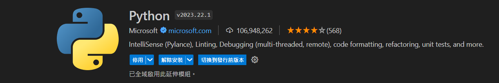
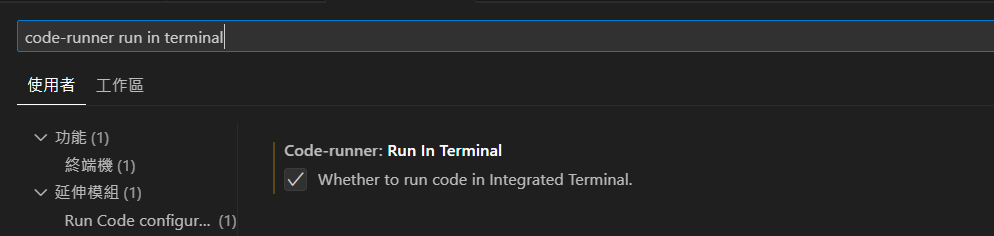

### 安裝 Python
:::info
通常執行安裝 Python 時會自動連pip (python 的軟體包管理系統) 一同裝好
:::
[Python 安裝檔載點](https://www.python.org/downloads/)
1. 執行安裝檔，勾選 `Add Python 3.11 to PATH`，這樣可以直接把 Python 設定為環境變數。
2. 打開 cmd，輸入 `python --version` 和 `pip --version` 觀察是否成功安裝 Python 和 pip。
:::warning
Windows 用戶不建議用 Git bash，畫面會卡住
:::
3. 同樣在 cmd ，輸入 `python`，沒意外的話會出現 Python 的執行環境。

### 在 VScode 中寫 Python
1. 安裝 [Python](https://marketplace.visualstudio.com/items?itemName=ms-python.python) 插件來讓 VScode 可以寫 Python。

:::tip
可以額外安裝 [Pylance](https://marketplace.visualstudio.com/items?itemName=ms-python.vscode-pylance) 提高使用體驗，但一定得先裝 Python
:::
2. 在設定中搜尋 `code-runner run in terminal`，將選項打勾，這樣 Python 的 `input` 語法才可以在 VScode 中使用。

:::info
`input` 允許使用者輸入一段內容，默認型態是字串
:::

### Python 基礎語法
在 Python 中，是使用`縮排`來定義區塊程式碼，以 `if-else` 舉例：
```py
if A:
    # do something
else:
    # do another thing
```

### 判別式
依據使用者成績輸入來回傳成績等第為範例：
```py
grade = input('enter your grade:')
grade = float(grade)

if grade > 1 or grade < 0:
    print('you must enter the number between 0-1')
elif grade >= 0.9:
    print('A')
elif grade >= 0.8:
    print('B')
elif grade >= 0.7:
    print('C')
elif grade >= 0.6:
    print('D')
else:
    print('F')
```

### 函式
以 def 定義函式：
```py
def computepay(a, b):
    ta = float(a)
    tb = float(b)
    if ta < 40:
        return ta * tb
    else:
        return 40 * tb + (ta - 40) * tb * 1.5
    
hrs = input('enter hours:')
rate = input('enter rate:')
print(computepay(hrs, rate))
```

### 迴圈
#### While
適用在不知道循環次數，只想針對某一個條件一直執行程式碼時：
```py
while True:
    try:
        num = input('enter number')
        if num == "done":
            break
        else:
            trNum = float(num)
            if largest == None and smallest == None:
                largest = trNum
                smallest = trNum
            elif largest < trNum:
                largest = trNum
            elif smallest > trNum:
                smallest = trNum
    except:
        print('Invalid input')
        continue
print('Maximum', largest)
print('Minium', smallest)
```
上述的意思是，當使用者輸入 `done` 時，就透過 `break` 跳出迴圈繼續執行之後的 code，而如果輸入的是數字就一直執行這個迴圈，直到使用者輸入 `done` 為止。

:::tip
**補充** `try-except`  
上述例子看到一個 `try-except` 的用法，這是 Python 中做例外處理的語法，是為了避免程式碼出錯而程式運行中斷而產生的語法。  

當上述的範例不使用 `try-except`：
```py title='wrong answer'
largest = None
smallest = None

while True:
    num = input('enter number')
    if num == "done":
        break
    else:
        trNum = float(num)
        if largest == None and smallest == None:
            largest = trNum
            smallest = trNum
        elif largest < trNum:
            largest = trNum
        elif smallest > trNum:
            smallest = trNum
print('Maximum', largest)
print('Minium', smallest)
```
程式碼仍然可以執行，但如果用戶今天輸入的內容無法轉為數字，比如輸入 `ABC`，因為 `float` 無法將其轉為浮點數，所以 Python 會噴出一段錯誤 **ValueError: could not convert string to float: 'ABC'**，並中斷程式執行。  

靠著 `try-except`，程式碼會優先執行 `try` 區塊中的邏輯，當如果出現錯誤才去執行 `except` 中的事情。

一開始的 `while` 迴圈中的 `try-except` 就是跟 Python 說：如果出現錯誤 (使用者輸入無法轉成浮點數的內容)，就印出一段訊息，並透過 `continue` 重新執行迴圈。
:::

#### for
適合用在規定尋換次數下執行程式碼。
```py
for i in range(1, 6):
    print(i)
```

### 參考資料
1. [Programming for Everybody (Getting Started with Python)](https://www.coursera.org/learn/python/home/week/1)