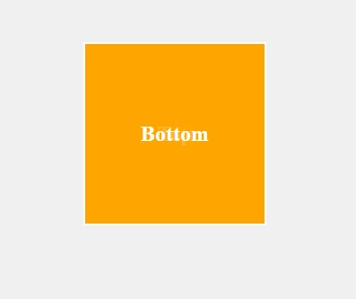
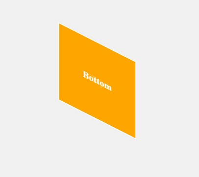
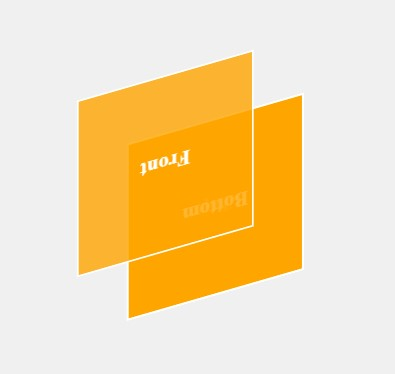
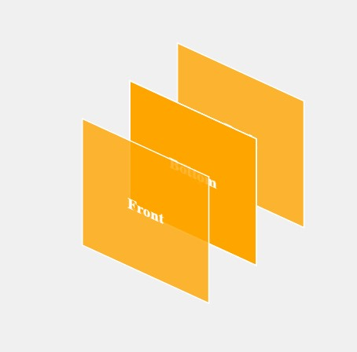
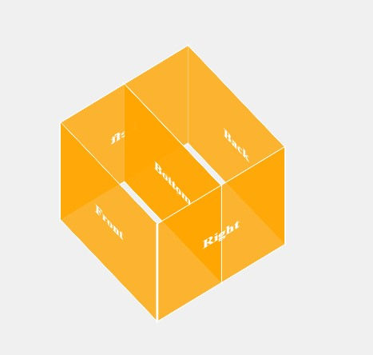

今天玩點進階的，第二天我們探討了如何使用 `transform` 對元素做變形，你會發現其中有些方法是針對 Z 軸的變形，這就是用來做 3D 變形的關鍵。  
所以今天主題我們來透過讓一個**立方體**在網頁上旋轉，粗淺地探索一下在 CSS 中如何實現 3D 變形動畫。

## 先來把 HTML 跟基礎 CSS 樣式寫好吧
```html
<div class="cube">
	<div class="face front">Front</div>
	<div class="face back">Back</div>
	<div class="face right">Right</div>
	<div class="face left">Left</div>
	<div class="face top">Top</div>
	<div class="face bottom">Bottom</div>
</div>
```
```css
.cube {
 width: 200px;
 height: 200px;
 position: relative;
}

.face {
 position: absolute;
 width: 200px;
 height: 200px;
 display: flex;
 justify-content: center;
 align-items: center;
 font-size: 24px;
 font-weight: bold;
 color: #fff;
 background-color: rgba(255, 165, 0, 0.8);
 border: 2px solid #fff;
}
```

現在的畫面會是像這樣，立方體的 6 個面都重疊在一起：  


## 變形開始！
1. 現在，我們先設定個動畫，讓重疊的 6 個面先延 X 軸旋轉 360 度，再延 Y 軸旋轉 360 度。
```css
@keyframes rotateCube {
 0% {
  transform: rotateX(0deg) rotateY(0deg);
 }
 100% {
  transform: rotateX(360deg) rotateY(360deg);
 }
}

.cube {
 animation: rotateCube 6s linear infinite;
}
```

請想像下面這張圖片是持續旋轉的 www  


你會發現，旋轉是旋轉了，但 6 個面還是都疊在一起轉啊，所以接下來就是重點了，我們要來把這 6 個面分開！

2. 現在 6 個面都是疊在一起的，我們假設現在這個平面的中心就是整個立方體的中心，每個面都各自從中心推出去 100px，就能形成一個長寬高都是 200px 的立方體。  
我們先推一個試試看，用 `translateZ(100px);` 讓 `front` 面往前推 100px：
```css
.front {
 transform: translateZ(100px);
}
```

然後你會發現，根本沒變化啊！你 484 騙我！  
沒有，絕對沒有，在這裡要跟大家隆重介紹 3D 動畫會用到的一個重要屬性：`transform-style: preserve-3d;`。  
這個屬性是用來告訴瀏覽器，這個元素的子元素是 3D 空間的，要保持 3D 空間的樣子，不要讓子元素變成平面。  
現在為父元素 `cube` 加上這個屬性：
```css
.cube {
 transform-style: preserve-3d;
}
```

現在可以看到我們把這個立方體的 `front` 面推出來了，可喜可賀！  



3. 接下來我們推 `back` 面，讓它往後推 100px，聰明的你學會舉一反三，知道要用 `translateZ(-100px);`：
```css
.back {
 transform: translateZ(-100px);
}
```

現在 `back` 面也推出來了，這樣我們就有了立方體的前後兩個面了！  


4. 接下來我們來推 `right` 與 `left` 面，讓它們往右與往左推 100px，然後因為要讓他們成為立方體的右與左面，所以要再加上 `rotateY(90deg);` 與 `rotateY(-90deg);` 來把他們從與 `front` 面平行的面變成垂直的右與左面：
```css
.right {
 transform: translateX(100px) rotateY(90deg);
}

.left {
 transform: translateX(-100px) rotateY(-90deg);
}
```



5. 最後我們來推 `top` 與 `bottom` 面，讓它們往上與往下推 100px，同理，因為要讓他們成為立方體的上與下面，我們要用 `rotate` 讓他們旋轉一下，但不同於 `right` 與 `left` 面，這次要用 `rotateX` 來讓他們從與 `front` 面平行的面變成垂直的上與下面：
```css
.top {
 transform: translateY(100px) rotateX(90deg);
}

.bottom {
 transform: translateY(-100px) rotateX(-90deg);
}
```

酷！現在我們就有了一個完整的立方體了！  

<iframe height="600" width="100%" title="day 05 - 3D_transform" src="https://codepen.io/ChungYingHo/embed/RwzxajL?default-tab=html%2Cresult" frameborder="no" loading="lazy" allowtransparency="true" allowfullscreen="true">
  See the Pen <a href="https://codepen.io/ChungYingHo/pen/RwzxajL">
  day 05 - 3D_transform</a> by ChungYingHo (<a href="https://codepen.io/ChungYingHo">@ChungYingHo</a>)
  on <a href="https://codepen.io">CodePen</a>.
</iframe>

## 補充說明：`transform-style`
`transform-style` 是一個用來定義**子元素**如何在 3D 空間中呈現的屬性。  
預設值是 `flat`，這個值會讓子元素變成平面，不會保持 3D 空間的樣子。  
而 `preserve-3d` 則會保持子元素在 3D 空間中的樣子，不會變成平面。  
這玩意兒在玩 3D 變形的時候很重要，要記得加上去喔！