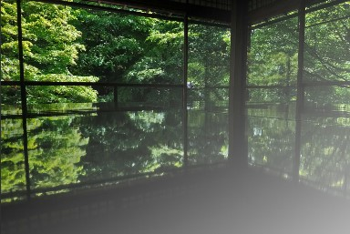
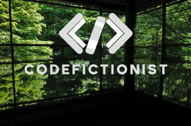

好了，我們總算脫離前面幾篇的動畫基礎，開始來點實務上常用的主題。但是呢，今天的主題不會用到 `animation` 跟 `transform` :stuck_out_tongue_closed_eyes:  
我們今天來聊聊 CSS 的多重背景。

相信多數人對 `background` 這個由屬性都不陌生，想為一個元素的背景添加色彩，或是用一張圖片當背景，都是用這個屬性。  
但我相信，大部分人都是省事直接套一張圖片或一個顏色當背景 (還是只有我偷懶 :no_mouth:)，鮮少會想用複數張圖片、或是漸層色彩來做多重背景。  
就我個人而言，時常記不住這個屬性的用法，每次都要去查一下 :sweat_smile:

## 漸層色背景
漸層色背景是透過 `linear-gradient()` 來實現的，這個函式可以接受多個參數，第一個參數是漸層的方向，後面的參數則是漸層的顏色。  
同常漸層的方向我們都會簡單用 `to top`、`to right` 這樣口語化的方式來表示，我們可以來看幾個白色漸層粉紅色的例子 (猛男就該用粉紅色 :smirk:)：
```css
/* 範例1: 背景色上面白下面粉紅 */
.section1 {
 background: linear-gradient(to bottom, white, pink);
}

/* 範例2: 背景色左上白右下粉紅 */
.section2 {
 background: linear-gradient(to bottom right, white, pink);
}
```


### 複數種漸層色
`linear-gradient()` 並沒有規定只能有兩種顏色，我們可以透過逗號 `,` 來分隔不同的漸層色。  
同時間我們可以在顏色後面加上一個百分比，來控制漸層的位置。  
```css
.section2 {
 background: linear-gradient(
  to bottom right,
  white 20%, /* 白色區域佔 20% */
  pink 50%,  /* 粉紅色漸變到 50% */
  lightblue 100% /* 粉藍色直到結束 */
 );
}
```


### 使用 `deg` 控制漸層方向
前面提到雖然我們很常從簡直接使用 `to top` 這樣的方式來控制漸層方向，但其實我們也可以用 `deg` 來控制漸層的角度。  
```css
.section3 {
 background: linear-gradient(195deg, white 60%, pink);
}
```


## 使用圖片做多重背景
### 圖片搭配顏色
通常這種技巧是使用在讓背景圖片網某個方向逐漸淡化的效果，藉以突出網站的內容。  
在這裡要注意一件事：**`linear-gradient()` 的漸層色要放在圖片的前面，否則會被圖片覆蓋掉**。
```css
.section4 {
 background: linear-gradient(
  to left top,
  rgba(255, 255, 255, 0.7),
  rgba(255, 255, 255, 0) 70%
 ),
 url("https://i.postimg.cc/bJs0ZYPS/DSC-1027.jpg") no-repeat center center /
 cover;
}
```

  
(夏天的琉璃光苑推薦大家去喔 :heart_eyes:)

### 多張圖片
多張圖片組成背景的技巧，沒啥可言的，就是想用兩張圖片來做成一個背景 XD。  
這裡有一個稍微有背一般 CSS 規則的地方，一般 CSS 大家所認知的是寫在後面的內容會覆蓋前面的內容，但是在 `background` 這個屬性裡面，寫在最前面的內容會被視為最上層，所以第一張圖片會是你想放在最上面的那張。  
以我下面例子來說，我第一個 `url` 放的是我部落格的 logo，第二個 `url` 放的是剛剛琉璃光苑的圖片，透過這樣排序，就做出一個 logo 在上面的背景圖了。
```css
.section5 {
 background: url("https://codefictionist.com/assets/images/logo-white-5d1024ae24f7dd517ec2750931e42d82.png") no-repeat right bottom / cover,
 url("https://i.postimg.cc/bJs0ZYPS/DSC-1027.jpg") no-repeat center center / cover;
}
```



<iframe height="600" width="100%" title="day  06 - multiple_background" src="https://codepen.io/ChungYingHo/embed/poXpGdG?default-tab=html%2Cresult" frameborder="no" loading="lazy" allowtransparency="true" allowfullscreen="true">
  See the Pen <a href="https://codepen.io/ChungYingHo/pen/poXpGdG">
  day  06 - multiple_background</a> by ChungYingHo (<a href="https://codepen.io/ChungYingHo">@ChungYingHo</a>)
  on <a href="https://codepen.io">CodePen</a>.
</iframe>

## Reference
1. [CSS 漸層背景](https://hackmd.io/@CynthiaChuang/CSS-Gradient-Backgrounds)
2. [css 通过background将两张图合成一张图显示](https://blog.csdn.net/qq_44869043/article/details/116126564)