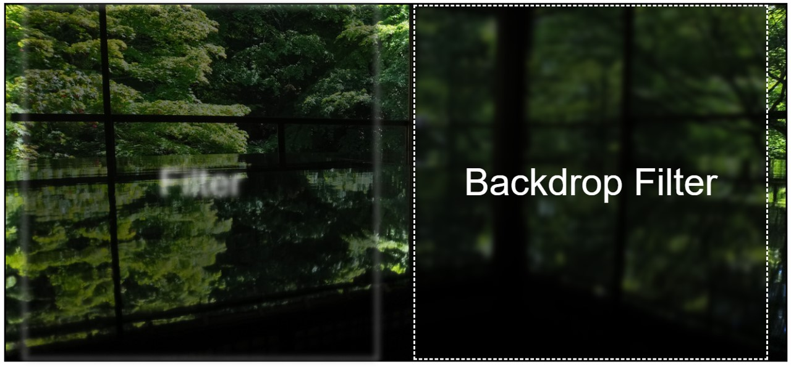

今天的主題我們聚焦在**模糊與濾鏡效果**上，在這裡我們會用上 `filter` 與 `backdrop-filter` 這兩個屬性。  
對於一般人來說，想要背景稍微不明顯、模糊一點，通常都是隨手加上個 `opacity`，但其實這樣的一種模糊可能並不是你最想要的那種模糊濾鏡。  
透過 `filter` 與 `backdrop-filter`，我們可以做出類似毛玻璃的那種感覺，怎麼說呢，一種更有質感的模糊 :sunglasses:

## `filter` 與 `backdrop-filter`
原則上，`filter` 與 `backdrop-filter` 適用的方法完全一致，會拆成兩個屬性主要是他們模糊的對象不同。  
`filter` 是針對元素內容進行模糊，而 `backdrop-filter` 則是針對元素背景進行模糊。  
還有一點就是，`backdrop-filter` 並不適用在沒有透明度的背景上，所以如果你想要使用 `backdrop-filter`，記得要先給背景一點透明度。

從下面例子我們可以看到 `filter` 會直接連同元素內部的文字一同給模糊掉，而 `backdrop-filter` 則只會模糊背景，文字不會受影響。

```html
<div class="container">
 <div class="element filter">Filter</div>
 <div class="element b-filter">Backdrop Filter</div>
</div>
```
```css
/* 省略那些共通 CSS */
.filter {
 filter: blur(5px);
}

.b-filter {
 backdrop-filter: blur(5px);
}
```


[CodePen 連結](https://codepen.io/ChungYingHo/pen/gONoJYg)

---

## 10 個 `filter` 與 `backdrop-filter` 方法
`filter` 與 `backdrop-filter` 的方法有如下：
1. `blur()`：模糊效果，值越大越模糊。
2. `brightness()`：亮度，值越大越亮。
3. `contrast()`：對比度，值越大對比度越高。
4. `grayscale()`：灰階，值越大越灰。
5. `hue-rotate()`：色相旋轉，值為角度。
6. `invert()`：反相，將顏色進行反轉，創造出色彩的負片效果。值越大反相越多。
7. `opacity()`：透明度，值越大越透明。
8. `saturate()`：飽和度，值越大飽和度越高。
9. `sepia()`：深褐色，值越大越深褐。
10. `drop-shadow()`：陰影，值為 `x`、`y`、`blur`、`color`。

<iframe height="600" width="100%" title="day 07 - filter_method" src="https://codepen.io/ChungYingHo/embed/wvLpbdy?default-tab=html%2Cresult" frameborder="no" loading="lazy" allowtransparency="true" allowfullscreen="true">
  See the Pen <a href="https://codepen.io/ChungYingHo/pen/wvLpbdy">
  day 07 - filter_method</a> by ChungYingHo (<a href="https://codepen.io/ChungYingHo">@ChungYingHo</a>)
  on <a href="https://codepen.io">CodePen</a>.
</iframe>

## Reference
1. [MDN filter](https://developer.mozilla.org/en-US/docs/Web/CSS/filter)
1. [MDN backdrop-filter](https://developer.mozilla.org/en-US/docs/Web/CSS/backdrop-filter)