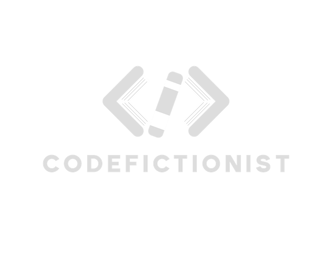
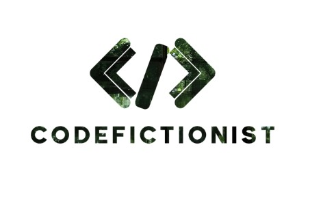

在我們開始之前，我們先來看這兩張圖：  
  


Well，也許你會說，這有啥特別的，不就一個個人部落格的 logo 跟一張前幾天也一直出現的照片嗎？(os: 到底是多愛琉璃光苑)  
當你有這想法，那慢著，我們來看看這張圖：  

  
[CodePen 範例](https://codepen.io/ChungYingHo/pen/vYqdvwE)

哇~有沒有，原先灰白色的 logo 突然底色變成琉璃光苑的照片，整個 logo 忽然靜謐文藝了起來！  
所以是怎麼做到的呢？我們來看看下面的 code：

```html
<div class="mask"></div>
```

```css
.mask {
 background: url("https://i.postimg.cc/bJs0ZYPS/DSC-1027.jpg") no-repeat top center;
 background-size: cover;
 -webkit-mask: url("https://codefictionist.com/assets/images/logo-white-5d1024ae24f7dd517ec2750931e42d82.png") no-repeat center center;
 mask: url("https://codefictionist.com/assets/images/logo-white-5d1024ae24f7dd517ec2750931e42d82.png") no-repeat center center;
 -webkit-mask-size: contain;
 mask-size: contain;
 width: 30rem;
 height: 30rem;
 margin: 0 auto;
}
```

可以看到我們這裡用了一個很少見的 CSS 屬性 `mask`，這個屬性是讓我們在網頁上做出各種圖片遮罩效果的關鍵。  
解析一下上面的 code：
1. 一開始是把元素的背景設為琉璃光苑的照片。
2. 再來透過 `-webkit-mask` 和 `mask` 這兩個屬性，把 logo 圖片設為遮罩。
3. 最後再設定 `mask-size` 來調整遮罩的大小。

至於為何要多設定帶 `-webkit-` 前綴的屬性呢？這是為了確保瀏覽器的相容性，我們需要多設定一個帶 `-webkit-` 前綴的屬性。

## 參考資料
1. [CSS Masks 圖片遮罩效果](https://timchen0607.medium.com/css-masks-%E5%9C%96%E7%89%87%E9%81%AE%E7%BD%A9%E6%95%88%E6%9E%9C-a6b6493a25bb)