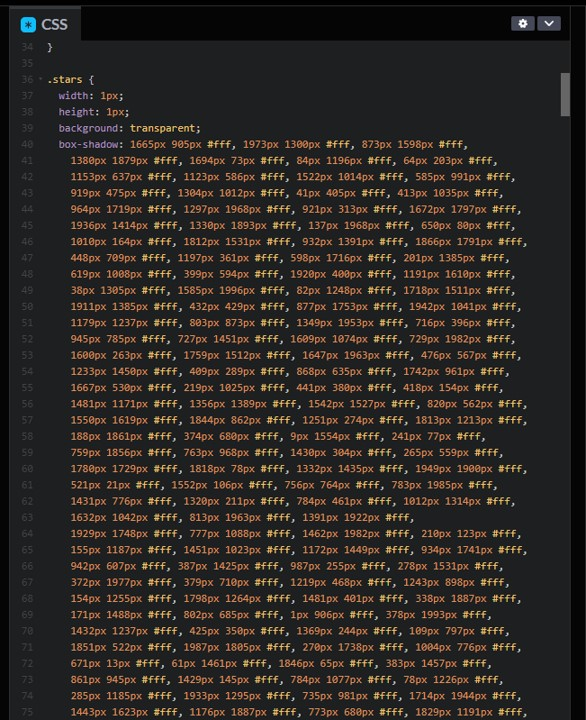

這個特效也是促成我寫這 30 天系列的原因之一。  
那時為了建我朋友工作室的網站，想說要在首頁添增一些會飄動的粒子特效來增加網頁的活潑感 (不要懷疑，我一個人幹了 UI/UX、前端、後端的事情)，在那邊找了一堆套件和教學都沒有我滿意的，陰錯陽差之下看到這篇文章：**[Day 29 鐵人賽太空粒子的例子](https://ithelp.ithome.com.tw/articles/10339244?sc=rss.iron)**，我才知道，哇，原來 `box-shadow` 可以拿來做粒子效果啊！(那時的我只會拿 `box-shadow` 來做很假的浮雕...)

不過毛哥 EM (上面那篇文章的作者) 是用純 CSS 撰寫這個效果的，你知道，這麼多點飄在螢幕上，它一共寫了多少個 `box-shadow` 嗎？  
看看下面這張圖，看旁變那個 scroll bar，往下全都是 `box-shadow` 的設定！



這...要我一個一個寫我實在受不了，所以後來我就改用 JavaScript 來控制生成粒子的數量以及隨機位置了。

## 粒子浮動效果
我們先來看 code：

```html
<div class="particle" />
```

```css
body {
 background: #282c34;
}

@keyframes star {
 from {
  transform: translateY(0);
 }
 to {
  transform: translateY(-2000px);
 }
}

.particle {
 width: 5px;
 height: 5px;
 border-radius: 50%;
 background-color: transparent;
 top: 0;
 left: 0;
 animation: star 100s linear infinite;
}
```

```javascript
const numShadows = 700;

const generateParticle = (numShadows) => {
 let boxShadowValue = "";

 for (let i = 0; i < numShadows; i++) {
  boxShadowValue += `${Math.random() * 2000}px ${Math.random() * 2000}px #fff, `;
 }

 // 移除最後一個逗號和空格
 boxShadowValue = boxShadowValue.slice(0, -2);

 return boxShadowValue;
};

const particleElement = document.querySelector(".particle");
particleElement.style.boxShadow = generateParticle(numShadows);
```

CSS 的關鍵部分其實只有 `animation` 的設定，這個動畫設定只是為了讓粒子可以無限循環地從上往下飄。  
JavaScript 的部分拆開後也很好懂：
1. `numShadows` 是我們要生成的粒子數量。
2. `generateParticle` 這個函式會回傳一個 `box-shadow` 的值，這個值是由 `numShadows` 決定的，每個粒子的位置都是隨機的。
3. 最後把這個值設定到 `.particle` 的 `box-shadow` 上。

<iframe height="600" width="100%" title="day 22 - particle" src="https://codepen.io/ChungYingHo/embed/YzoJpvj?default-tab=html%2Cresult" frameborder="no" loading="lazy" allowtransparency="true" allowfullscreen="true">
  See the Pen <a href="https://codepen.io/ChungYingHo/pen/YzoJpvj">
  day 22 - particle</a> by ChungYingHo (<a href="https://codepen.io/ChungYingHo">@ChungYingHo</a>)
  on <a href="https://codepen.io">CodePen</a>.
</iframe>

## Reference
1. [Day 29 鐵人賽太空粒子的例子](https://ithelp.ithome.com.tw/articles/10339244?sc=rss.iron)