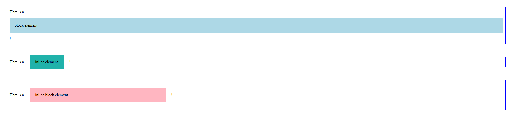

說道骨架都會想到原神裡稻妻那隻蛇神奧羅巴斯的超巨大蛇骨架 (x)。  
HTML 是 web 開發初學者會碰的地個非程式語言的架構語言 (我在公三小)，但他對 web 的重要性相當於鋼筋水泥對於建築物那樣重要。  
這裡不會去從頭開始說 HTML 到底該怎麼用，著重在那些面試時有機會會被問起的問題。  

事實上，實務開發時通常都是 Vue 或 React (別再提 Angular 那個老東西了) 搭配合適的 UI 框架 (Quasar、NextUI...等) 之類的來進行開發，通常會把很多 HTML、CSS，甚至說，一些 JavaScript 的部分都交給了這些框架來處理。很常實務上就是直接使用框架提供的 component 來進行開發，說真的，我最常寫到的幾個 HTML element 大概是 `
`、``、`
` 這種非常單純定義區塊或文字的 element，很多時候，這裡我用 Quasar 舉例，都會為那些常見的 web 元素寫好一個 component，例如：`q-btn`、`q-input`...等。  
但其實面試這裡最常被考的就是因為過於習慣框架開發而忽略的一些基本問題，所以以下就這幾點來聊聊：
1. Block element 與 Inline element
2. Semantic HTML

## Block element 與 Inline element
我之前曾經為了跳槽去面過高雄某軟體公司，當時筆試題目有一題我印象有些深刻：

> 請問 `<a href="..." style="width: 100px;" />` 為何樣式沒有作用？

Well，這個乍看之下是在考 CSS，如果思路真的往 CSS 那邊跑，開始思考莫非 `<a>` 不吃 width？嗯，那可能有點不妙。  
其實這提最大的癥結點出在 `<a>` 是一個 inline element，而 inline element 是不接受 width、height 這些 block-level element 才有的屬性的。

但通常這種基本知識都很常被拋在腦後，所以來複習一下 block-level element 與 inline element 的差異：

| 類別 | Element | 特性 |
| --- | --- | --- |
| Block-level element | `
`、`
`、`<h1>`、`<ul>`、`<li>`... | 佔據一整行，可以設定 width、height |
| Inline element | ``、`<a>`、`<input>`、``... | 不佔據一整行，不接受 width、height 的設定 |

有趣的是有個東西叫做 inline-block，透過 `display: inline-block` 可以讓一個 inline element 具有 block-level element 的特性，這個情況下就可以設定 width、height，但要記得，他仍然屬於「行內」元素。  
我們就單純記得，block 可以設定的同樣可以設定給 inline-block，但它仍與其他 inline 或 inline-block 元素並排顯示 (重申一次，block 會自己吃掉一行)。

另外 padding 跟 margin 在 block-level element 與 inline element 上的表現也略有不同：
1. block-element：margin 和 padding 上下左右都生效，會影響整行的高度和間距。
2. inline-element：
    - margin 只有左右生效，上下不影響佈局。
    - padding 上下雖然有效，但不會改變行高，只是背景會擴展。

{/*  */}

<iframe height="600" width="100%" title="day01-HTML" src="https://codepen.io/ChungYingHo/embed/mydRMQJ?default-tab=html%2Cresult" frameborder="no" loading="lazy" allowtransparency="true" allowfullscreen="true">
  See the Pen <a href="https://codepen.io/ChungYingHo/pen/mydRMQJ">
  day01-HTML</a> by ChungYingHo (<a href="https://codepen.io/ChungYingHo">@ChungYingHo</a>)
  on <a href="https://codepen.io">CodePen</a>.
</iframe>