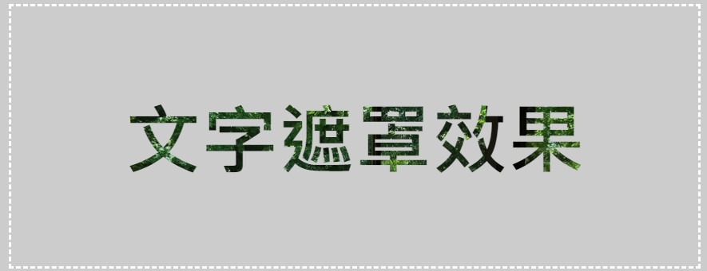
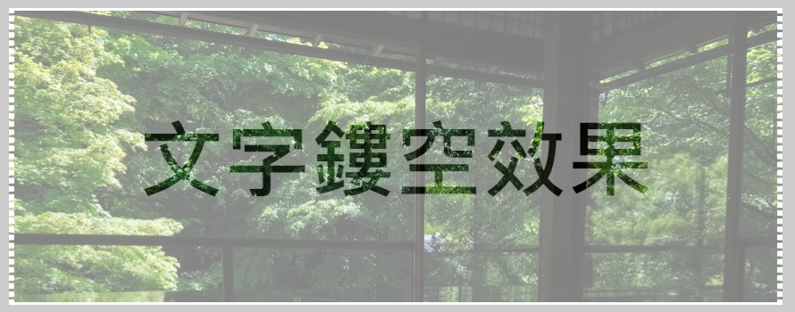

今天再回到文字的背景，我們在 Day 10 介紹過圖片的遮罩效果，今天來看看文字的遮罩效果。  
在文字上做遮罩其實比對圖片來說簡單很多，只要透過 `background` 和 `background-clip` 就可以輕鬆達成。  
(如果你記得的話，圖片遮罩還得靠屬性 `mask` 來達成)

## 文字遮罩效果
先直接來看 code：
```html
<div class="mask-text">文字遮罩效果</div>
```
```css
.mask-text {
 background: url("https://i.postimg.cc/bJs0ZYPS/DSC-1027.jpg") no-repeat top center;
 background-clip: text;
 color: transparent;
}
```



其實這裡的原理很簡單，就是透過 `background-clip` 將背景設定在文字上，這裡記得將文字的顏色設定為透明，這樣背景才能顯示出來。

## 文字鏤空效果
使用 `background` + `background-clip` 也可以做出文字鏤空的效果，什麼叫文字的鏤空效果呢？我們看一下成果：



細細觀察這個效果，就是在一層圖片上疊上一層半透明白色薄罩，然後在疊上文字，呈現一種文字鏤空的效果。  
實際上在寫 code 也是按照這順序來：
```html
<div class="hollow-text">
 <div class="white-bg">
  <div class="text">
   文字鏤空效果
  </div>
 </div>
</div>
```
```css
.hollow-text {
 background: url("https://i.postimg.cc/bJs0ZYPS/DSC-1027.jpg") no-repeat top center;
}

.white-bg {
 background: rgba(255, 255, 255, 0.5);
}

.text {
 background: url("https://i.postimg.cc/bJs0ZYPS/DSC-1027.jpg") no-repeat top center;
 color: transparent;
 background-clip: text;
}
```

1. 先在最外層 `.hollow-text` 設定背景圖片。
2. 在 `.white-bg` 設定一層半透明白色背景。
3. 在 `.text` 設定文字的背景圖片，並將文字顏色設定為透明，這樣背景才能顯示出來。

其實說白了，鏤空就只是把具遮罩效果的文字再套上一層背景而已。只是因為套用背景一致，所以看起來像是透過去的感覺。

[Codepen 連結](https://codepen.io/ChungYingHo/pen/WNqJzwJ?editors=1100)

## Reference
1. [CSS 文字鏤空與遮罩效果](https://w3c.hexschool.com/blog/9f36ba96)