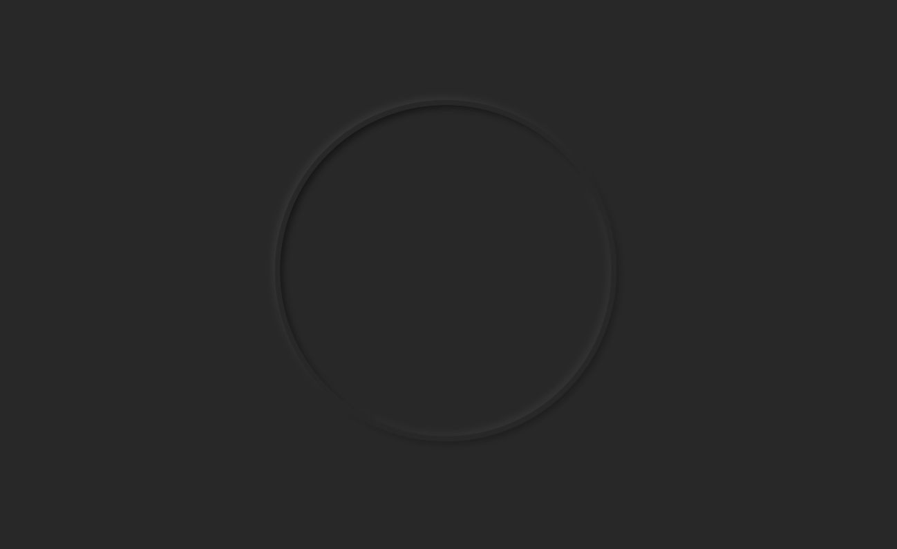
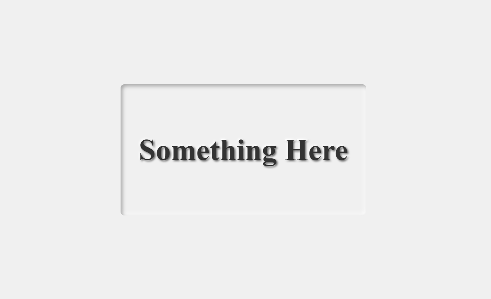

我們 Day 22 講過怎麼用 `box-shadow` 創造粒子浮動效果，那時有稍稍提過一嘴用 `box-shadow` 做浮雕效果，今天就是要來實際做一下這個效果。  
`box-shadow` 其實大家應該很常用啦，但通常都是簡單地為元素添加一些陰影製造一點立體的感覺，讓網頁看起來不那麼平面。  
而浮雕效果其實就是透過多個陰影的組合，來更深度模擬光從某個方想打過來照射到元素上產生影仔的感覺，加強那個 3D 的感覺。  
然後稍稍提一下 `text-shadow`，如果是要為文字做浮雕，就得使用它，我們下面會有例子。

## 浮雕效果
我們先來看個例子，這是我早期跟著某網站的教學做的 analog clock 的時鐘外框，就是使用 `box-shadow` 做的浮雕效果：

```html
<div class="container">
 <div class="section">
  <div class="clock"></div>
 </div>
</div>
```

```css
.section {
 background-color: #282828;
}

.clock {
 border: #282828 solid 7px;
 border-radius: 100%;
 box-shadow: -4px -4px 10px rgba(67, 67, 67, 0.5),
  4px 4px 10px rgba(0, 0, 0, 0.5) inset,
  -4px -4px 10px rgba(67, 67, 67, 0.5) inset,
  4px 4px 10px rgba(0, 0, 0, 0.3);
 width: 30rem;
 height: 30rem;
}
```



## 浮雕外框結合浮雕文字
`box-shadow` 的 `inset` 屬性大家應該也不陌生，就是讓陰影在元素內部而不是外部。  
透過這個設定，我們可以讓外容器 (父元素) 看起來像是內凹的浮雕效果，再透過 `text-shadow` 給文字加上凸出的浮雕效果，就可以做出一個立體的雕刻感覺：

```html
<div class="container">
 <div class="section">
  <div class="section2-container">
   <p>Something Here</p>
  </div>
 </div>
</div>
```

```css
.section {
 background-color: #f0f0f0;
}

.section2-container {
 padding: 3rem;
 border-radius: 10px; /* 圓角 */
 box-shadow: inset 5px 5px 10px rgba(0, 0, 0, 0.3),
  inset -5px -5px 10px rgba(255, 255, 255, 0.8);
}

.section2-container p {
 font-size: 5rem;
 font-weight: bold;
 color: #333;
 text-shadow: 3px 3px 5px rgba(0, 0, 0, 0.6),
  -3px -3px 5px rgba(255, 255, 255, 0.8);
}
```



[Codepen 連結](https://codepen.io/ChungYingHo/pen/BagvPRE?editors=1100)