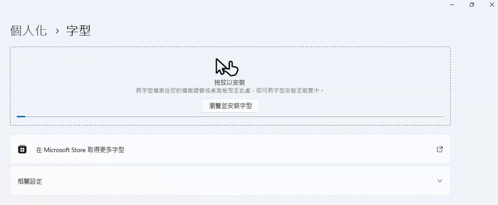
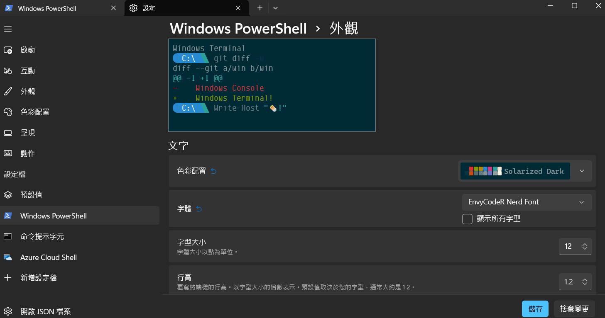
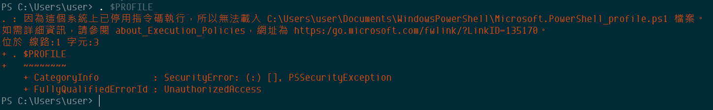

:::warning
後來發現這東西超吃系統資源...:sweat_smile:
:::
## powershell 終端機美化
1. 前往 [Oh My Posh](https://ohmyposh.dev/)，在 Docs/Get Started/Installation 選取需求的版本 (`以下為 windows 範例`)。
2. 使用指令安裝：
```powershell
winget install JanDeDobbeleer.OhMyPosh -s winget
```
3. 重啟 terminal。
4. 輸入以下指令測試是否完成安裝：
```powershell
oh-my-posh.exe
```
:::warning
如遇錯誤，且重新安裝還是錯誤，改先執行這段：
```powershell
$env:Path += ";C:\Users\user\AppData\Local\Programs\oh-my-posh\bin"
```
:::
5. 安裝字體 (必要選項，不然會出現亂碼)，下面連結選擇一個喜歡的字體下載：
:::info
[Nerd Fonts](https://www.nerdfonts.com/)
:::
6. 將剛剛下載的字體檔案解壓縮，前往電腦`設定/個人化/字型`拖曳安裝。



7. 回到 terminal，輸入指令安裝應用，會跳出很多字體供選擇，找到剛剛下載安裝的套用：
```powershell
oh-my-posh font install
```
8. 電腦搜尋 `windows powershell`，可以在裡面找到 `設定/外觀`，把字體包丟給系統。



9. 測試 $PROFILE 是否存在，若為 `True` 直接跳到第 11 點：
```powershell
Test-Path $PROFILE
```
10. 第 9 點如為 `False`，輸入以下指令建立新的：
```powershell
New-Item -Path $PROFILE -Type File -Force
```
11. 進入 $PROFILE，添加指令並儲存：
```powershell title='Go into $PROFILE'
notepad $PROFILE
```
```powershell title='$PROFILE 添加這行'
oh-my-posh init pwsh | Invoke-Expression
```
12. terminal 執行 $PROFILE
```powershell
. $PROFILE
```
:::warning


如果遇到如上錯誤訊息，請執行下述指令後再重新執行 `. $PROFILE`：
```powershell
get-executionpolicy
set-executionpolicy remotesigned
```
:::note
有些電腦會有權限限制，上述指令會無法運作，請執行：
```powershell
Set-ExecutionPolicy -Scope CurrentUser
```
之後輸入參數 `remotesigned`
:::
13. 打開 `Visual Studio User Setting.json`，更改字體配置：
```json
"editor.fontFamily": "EnvyCodeR Nerd Font",
"terminal.integrated.fontFamily": "EnvyCodeR Nerd Font",
```
:::warning
如果 VScode 中 powershell 出現問題，就按上面的流程在 VScode 中再做一次。
:::
14. **補充** 更改 theme，在 [Oh My Posh - Theme](https://ohmyposh.dev/docs/themes#jandedobbeleer) 找到喜歡的樣式，代入執行下面指令：
```powershell
oh-my-posh init pwsh --config "$env:POSH_THEMES_PATH/jandedobbeleer.omp.json" | Invoke-Expression
```
:::tip
需要更改的是 `jandedobbeleer` 位子，這是樣式名稱。
:::