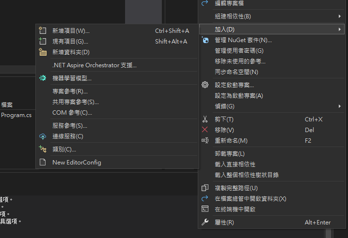

:::info
[C# 線上練習網站](https://dotnetfiddle.net/)
:::

## 認識 C# 架構
### Basic Structure
```csharp
using System;

class Hello
{
static void Main()
  {
    Console.WriteLine("Hello, World");
  }
}
```
這是最基礎的 C# 程式碼架構，也是微軟 C# 官方教學的第一個範例，這個範例中有幾個重要的元素：
- `using System;`：這是引用命名空間的語法，`System` 是 C# 的核心命名空間，這個命名空間中包含了很多基本的類別，例如 `Console` 類別。本來的 code 可以寫成 `System.Console.Writeline`，但是因為引用了 `System` 命名空間，所以可以直接寫成 `Console.Writeline`。
- `class Hello`：這是一個類別的宣告，類別是 C# 的基本結構，所有的程式都是寫在類別中的。類別用於封裝方法、屬性和其他類別。
- `static void Main()`：`Main` 方法是 C# 程式的進入點，C# 的執行流程會從這個方法開始執行，所以一個 C# 專案中至少需要有一個 Main 方法作為程式的起始點。

:::tip
現在用 VS 建 C# 專案，你會發現在最一開始的 **Program.cs**，也就是 VS 預設幫忙建有 `Main` 方法的檔案，它頂層不會有有 `using system`，但當我們自己在這個專案下又建立其它新的 cs file 來撰寫不同邏輯時，VS 卻又自己幫我們引進許多 namespace，這是因為 VS 幫我們初始化專案時會有一行這樣的設定：`<ImplicitUsings>enable</ImplicitUsings>`。這個設定會讓系統自動在我們的 Program.cs (專案的入口) **隱式**做 `using...` 的動作，但其它 cs 檔案就沒享受到這個福利了。
:::

:::warning
好像是 .NET 6.0 提供了一種叫**最上層陳述式**的語法，可以不用寫 `class` 這個關鍵字，直接寫方法，算是省去了一些程式碼吧，但大家都推薦還是要先學基礎的傳統語法。  
順道一提，為 Unity 學 C# 的夥伴，Unity 自己產生的 cs file 是屬於傳統式寫法。

```cs
using System;

Console.WriteLine("Hello, World");
```
:::

### Full Structure
但通常一個方案下都會有 N 個專案，每個專案又都有 N 個 cs 檔案各司其職，比如一個遊戲方案下可能有一個專案負責卡牌遊戲的邏輯、一個負責跑酷遊戲的邏輯，這兩個專案下在由複數隻負責不同功能的 cs 檔案組成一個完整的遊戲功能。  
有一個重點是，通常一個專案就會視為一個 namespace，也都會有獨立一個含有 `Main` 方法的 Program.cs。

現在假設有一個方案為 **cs_practice**，裡面有兩個專案，分別是 **test** 跟 **test2**，裡面又有複數個 cs 檔案，下面透過範例介紹怎麼在同一個專案中引用其它 cs 檔案的方法以及怎麼在其他專案中引用另一專案的方法。
```xml title="方案架構"
--- cs_practice
    ---- test
        ---- Program.cs
        ---- Calculator.cs
        ---- Greeting.cs
    ---- test2
        ---- Program.cs
        ---- HiFriend.cs
```

- test 專案
```cs title="Program.cs"
using test2;

namespace test
{
    internal class Program
    {
        static void Main()
        {
            Calculator calculator = new();
            Greeting greeting = new();
            HiFriend hiFriend = new();

            Console.WriteLine(calculator.Add(1, 2));
            greeting.SayHello();
            hiFriend.SayHi();
        }
    }
}
```
```cs title="Calculator.cs"
using System;
using System.Collections.Generic;
using System.Linq;
using System.Text;
using System.Threading.Tasks;

namespace test
{
    internal class Calculator
    {
        public int Add(int a, int b)
        {
            return a + b;
        }
    }
}
```
```cs title="Greeting.cs"
using System;
using System.Collections.Generic;
using System.Linq;
using System.Text;
using System.Threading.Tasks;

namespace test
{
    internal class Greeting
    {
        public void SayHello()
        {
            Console.WriteLine("Hello, World!");
        }
    }
}
```

- test2 專案
```cs title="Program.cs"
namespace test2
{
    internal class Program
    {
        static void Main(string[] args)
        {
            Console.WriteLine("Hello, World!");
        }
    }
}
```
```cs title="HiFriend.cs"
using System;
using System.Collections.Generic;
using System.Linq;
using System.Text;
using System.Threading.Tasks;

namespace test2
{
    public class HiFriend
    {
        public void SayHi()
        {
            Console.WriteLine("Hi, Friend!");
        }
    }
}
```

現在來專注看回 **test** 專案的 `Program.cs`：
```cs title="Program.cs"
using test2;

namespace test
{
    internal class Program
    {
        static void Main()
        {
            Calculator calculator = new();
            Greeting greeting = new();
            HiFriend hiFriend = new();

            Console.WriteLine(calculator.Add(1, 2));
            greeting.SayHello();
            hiFriend.SayHi();
        }
    }
}
```
已知 `Calculator` 跟 `Greeting` 都同樣是 test 專案下的其他 cs 檔案中的 class，在 `Program.cs` 中可以直接使用 `Calculator calculator = new();` 來在 `Main` 方法中實例化 `Calculator` 這個 class。  
而 `HiFriend` 是 test2 專案下的 class，所以要先引用 `using test2;`，才能在 `Main` 方法中實例化 `HiFriend` 這個 class。

有一個重點是，不是說直接 `using test2` 就能將 **test2** 專案的東西引入 **test** 專案中。首先必須在 VS 中在 test 專案上按右鍵，選擇**加入**，然後選擇**專案參考**，這時打開 **test.cs.prog** 會看到多一行 `<ProjectReference Include="..\test2\test2.csproj" />`，這樣才能在 test 專案中寫 `using test2;` ，然後使用 test2 專案的東西。

```cs title="test.csproj"
<Project Sdk="Microsoft.NET.Sdk">

  <PropertyGroup>
    <OutputType>Exe</OutputType>
    <TargetFramework>net8.0</TargetFramework>
    <ImplicitUsings>enable</ImplicitUsings>
    <Nullable>enable</Nullable>
  </PropertyGroup>

  <ItemGroup>
  // highlight-next-line
    <ProjectReference Include="..\test2\test2.csproj" />
  </ItemGroup>

</Project>
```



---

## 判別式
### if-else
最基本的判別式，如果條件為 `true` 則執行 `if` 的 code，否則執行 `else` 的 code：
```cs
int a = 1;
int b = 2;
if (a > b)
{
    Console.WriteLine("a > b");
}
else
{
    Console.WriteLine("a <= b");
}
```

### switch-case
`switch` 會根據變數的值來執行對應的 `case`，如果沒有符合的 `case` 則會執行 `default`：
```cs
int day = 4;
switch (day)
{
    case 1:
        Console.WriteLine("Monday");
        break;
    case 2:
        Console.WriteLine("Tuesday");
        break;
    case 3:
        Console.WriteLine("Wednesday");
        break;
    case 4:
        Console.WriteLine("Thursday");
        break;
    case 5:
        Console.WriteLine("Friday");
        break;
    case 6:
        Console.WriteLine("Saturday");
        break;
    case 7:
        Console.WriteLine("Sunday");
        break;
    default:
        Console.WriteLine("Invalid day");
        break;
}
```

---

## 迴圈
### while
`while` 會在條件為 `true` 時一直執行直到條件為 `false`：
```cs
int i = 0;
while (i < 5)
{
  Console.WriteLine(i);
  i++;
}
```

### do-while
`do-while` 會先執行一次 code，再檢查條件是否為 `true`：
```cs
int i = 0;
do
{
  Console.WriteLine(i);
  i++;
} while (i < 5);
```

### for
```cs
for (int i = 0; i < 5; i++)
{
  Console.WriteLine(i);
}
```

### foreach
`foreach` 用來遍歷集合的元素：
```cs
var numbers = new List<int> { 1, 2, 3, 4, 5 };
foreach (int number in numbers)
{
  Console.WriteLine(number);
}
```