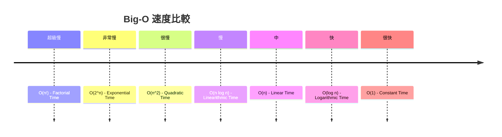

### O(1) - Constant Time
常數時間複雜度，無論輸入的規模多大，執行時間都是固定的。

### O(n) - Linear Time
線性時間複雜度，執行時間與輸入的規模成正比。

### O(n^2) - Quadratic Time
平方時間複雜度，當輸入規模增長，執行時間呈平方成長。  
舉例來說，假設一個演算法的時間複雜度是 `O(n^2)`，當 `n = 3` 時，執行時間可能是 `3^2 = 9` 單位時間。當 `n = 4` 時，執行時間可能是 `4^2 = 16` 單位時間。

### O(log n) - Logarithmic Time
對數時間複雜度，當輸入規模增長，執行時間呈對數成長。  
舉例來說，假設一個演算法的時間複雜度是 `O(log n)`，當 `n = 8` 時，執行時間可能是 3 個單位時間。當 `n = 16` 時，執行時間可能是 4 個單位時間。雖然 n 增加了一倍，但執行時間只增加了一個單位時間。

### O(n log n) - Linearithmic Time
線性對數時間複雜度，當輸入規模增長，執行時間以 n 乘以 log n 的速率增長。  
舉例來說，假設一個演算法的時間複雜度是 `O(n log n)`，當 `n = 8` 時，執行時間可能是 ``8 * log₂(8) = 24 單位時間。當 `n = 16` 時，執行時間可能是 `16 * log₂(16) = 64` 單位時間。儘管 n 增加了一倍，但執行時間增長了更多，以 n 乘以 log n 的速率增長。

### O(2^n) - Exponential Time
指數時間複雜度，當輸入規模增長，執行時間呈指數成長。  
舉例來說，當 `n = 3` 時，執行時間可能是 `2^3 = 8` 單位時間。當 `n = 4` 時，執行時間可能是 `2^4 = 16` 單位時間。

### O(n!) - Factorial Time
時間複雜度表示隨著輸入規模 n 的增加，執行時間以階乘方式增長。  
舉例來說，當 `n = 3` 時，執行時間可能是 `3! = 6` 單位時間。當 `n = 4` 時，執行時間可能是 `4! = 24` 單位時間。

### 參考資料
1. [Meta Back-End Developer Professional Certificate](https://www.coursera.org/professional-certificates/meta-back-end-developer)