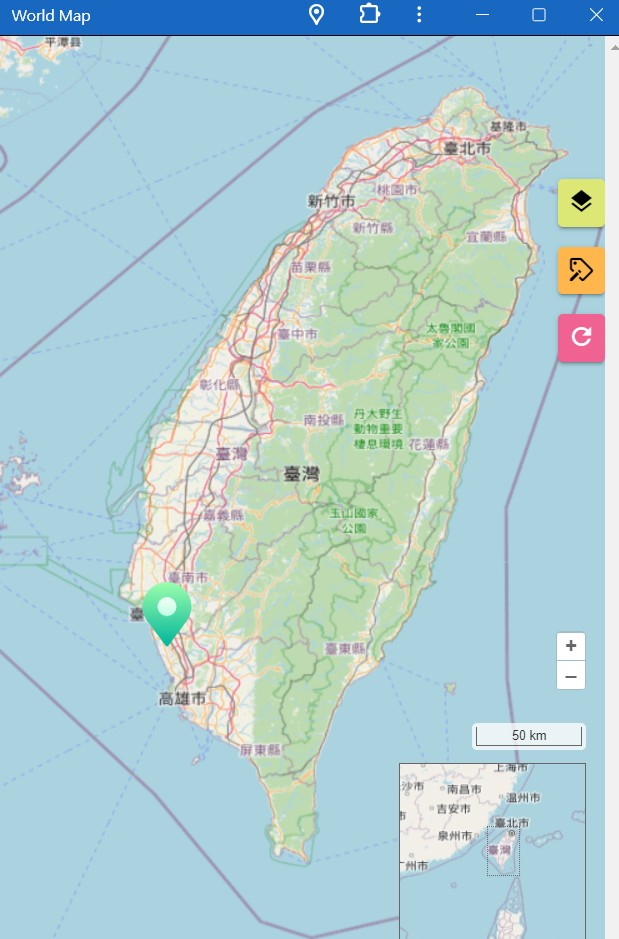

## manifest.json
基本上 `manifest.json` 就是提供應用程式的相關資訊，諸如：  
* name: 應用程式名稱。
* short_name: 應用程式簡寫。
* description: 應用程式描述。
* theme_color: 應用程式主色調。
* background_color: 啟動畫面背景色。
* icons: 應用程式的圖示。
上有許多設定未列出，可以參考 [MDN](https://developer.mozilla.org/zh-TW/docs/Web/Manifest)。

## Workbox
前篇文章有講到 service worker 是 PWA 技術的核心架構，而 workbox 就是 Google 提供拿來簡化使用 service worker 的工具箱。  
通常來說，原生寫 PWA 的方式 (不使用任何套件) 是建立一個 `sw.js`，並在裡面撰寫包括緩存策略、離線支援、推送通知等相關設定。

## 在 Nuxt3 專案中實作 PWA
:::tip
[Demo 網站](https://chungyingho.github.io/Nuxt3-PWA-Map/)  

:::
Nuxt3 官方有推薦使用的 PWA 套件，故這裡是使用套件 [vite-pwa-nuxt](https://vite-pwa-org.netlify.app/frameworks/nuxt) 的做法。
1. 安裝 [vite-pwa-nuxt](https://vite-pwa-org.netlify.app/frameworks/nuxt)
```bash
npm install -D @vite-pwa/nuxt
```
2. 前往 `nuxt.config.ts` 進行設定
```ts
export default defineNuxtConfig({
  modules: ['@vite-pwa/nuxt'],
  pwa: {
    /* your pwa options */
  }
})
```
3. 現在開始撰寫剛剛 `nuxt.config.ts` 內 pwa 的內容
```ts
pwa: {
    // 指定 PWA 的範圍和基本路徑
    scope: '/',
    base: '/',
    // 控制 PWA 的安裝和註冊行為
    injectRegister: 'auto',
    registerType: 'autoUpdate',
    // Web Manifest 的配置，包括應用程式的名稱、圖標、顏色等
    manifest: {
      name: 'World Map',
      short_name: 'World Map',
      description: 'World Map made with openlayers',
      theme_color: "#1867c0",
      background_color: "#1867c0",
      icons: [
        {
          src: 'street-map.png',
          sizes: '512x512',
          type: 'image/png',
          purpose: 'any'
        }
      ],
    },
    // 目的是將 Web Manifest 的註冊控制交給開發者，而不是由 PWA 插件自動處理
    registerWebManifestInRouteRules: true,
    // 生成 Service Worker 的庫，這裡指定了一些關於 Service Worker 行為的配置，例如快取策略和網路請求的處理
    workbox: {
      // 指定當使用者在離線狀態下訪問不在 cache 中的頁面時的回退策略
      navigateFallback: undefined,
      // Service Worker 啟動時清理舊的快取。這有助於確保用戶始終獲取到最新版本的應用程式內容。
      cleanupOutdatedCaches: true,
      // 定義了需要被緩存的檔案模式。
      globPatterns: ['**/*.{json,ico,svg,ttf,woff,css,scss,js,html,txt,jpg,png,woff2,mjs,otf,ani,vue}'],
      // 定義了運行時快取的規則
      runtimeCaching: [
        // 當有與根路徑匹配的請求時，Service Worker 會優先使用網路請求，如果網路請求失敗，則使用緩存的資源
        {
          urlPattern: "/",
          handler: 'NetworkFirst',
        },
      ],
    },
    // 客戶端配置
    client: {
      // 是否禁用安裝提示
      installPrompt: false,
      // Service Worker 周期性檢查更新的時間 (秒)
      periodicSyncForUpdates: 20,
    },
    // 開發端配置
    devOptions: {
      // 此選項啟用或禁用 PWA 開發選項
      enabled: true,
      // 控制是否抑制 PWA 開發過程中生成的警告消息
      suppressWarnings: false,
      // 定義當使用者訪問未緩存頁面時導向的 URL
      navigateFallback: 'index.html',
      type: 'module',
    }
}
```
4. 在 `app.vue` 中使用套件提供的 functional component `NuxtPwaManifest `。
```js
<template>
  <NuxtPwaManifest />
  <NuxtPage />
</template>
```
:::warning
若要部屬上線，要注意修正 `scope`, `base`, `urlPattern`。
:::


## 參考資料
1. [How to turn your Nuxt GeoApplication into a PWA](https://www.geoglify.com/blog/how-to-turn-nuxt-app-into-pwa/)
2. [使用 Manifest 創建你的 PWA — 基礎 Progressive Web App 教學](https://medium.com/front-end-augustus-study-notes/pwa-minifest-6943b5fc65a9)