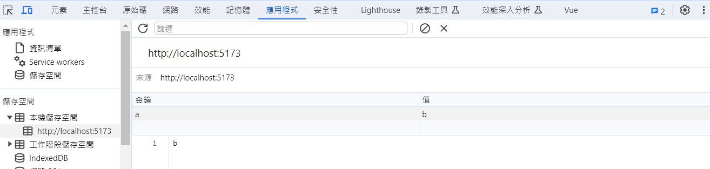
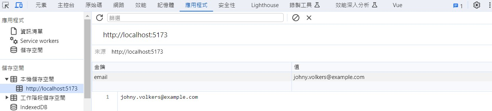

### 功能要求
1. 使用者離開瀏覽器跳出彈出視窗。
2. 使用者離開瀏覽器清空 localstorage。
3. 使用者離開瀏覽器時打 API。

### 關於網頁生命週期
在網頁載入時有幾個重要的事件：  
1. `DOMContentLoaded`：DOM 讀取解析後就觸發。
2. `load`：所有資源都載入後觸發。
3. `beforeunload`：網頁卸載前觸發。
4. `unload`：網頁卸載後觸發。

故以上所有功能都必須在`網頁卸載前`觸發，因此必須使用`beforeunload`。

### vue 的生命週期
因為這次實作是以 vue3 執行 (配合公司專案)，所以操作上必須配合 vue 組件的生命週期 API。  
1. `onMounted`：組件掛載完成後執行。
2. `onBeforeUnmount`：組件卸載前執行。

### 實作彈出視窗

```js
function handleReset(event){
  // 觸發彈跳視窗
  event.preventDefault()
  // 支援舊式瀏覽器
  event.returnValue = ''
}

// 組件掛載時開始監聽事件
onMounted(()=>{
  window.addEventListener('beforeunload', handleReset)
})
// 組件卸載前移除監聽事件
onBeforeUnmount(()=>{
  window.removeEventListener('beforeunload', handleReset)
})
```
:::warning
關於彈跳視窗觸發，如果今天使用者沒有對網頁進行互動，比如只是打開一個印有`Hello, world!`字串的網頁，那離開或重整網頁時並不會觸發。
:::

### 實作清空 localstorage
1. 先手動在加入一組 key-value ("a":"b") 在 localstorage 中。

2. 實際關閉網頁後再打開，觀察 localstorage 中是否仍存有這筆數據 (理論上要有)。
3. `handleReset` 函式加入下述這段：
```js
function handleReset(event){
  event.preventDefault()
  event.returnValue = ''
  // 加入這行
  localStorage.removeItem('a')
}
```
4. 再次關閉網頁後並再次進入，觀察 localstorage 是否已被清空。

### 實作打 API
這裡使用 API 可以隨意測試使用：
```js
let apiUrl = 'https://randomuser.me/api/'
```
1. 先定義好打 API 的非同步處理事件：
```js
const fetchFunc = ()=>{
    fetch(apiUrl)
    .then(response => response.json())
    .then(data =>{
        let user = data.results[0]
        let email = user.email
        localStorage.setItem('email', email)
        console.log('API request successful:', email)
    })
    .catch(error => console.log(error))
}
```
2. `handleReset` 函式加入下述這段：
```js
function handleReset(event){
  event.preventDefault()
  event.returnValue = ''
  localStorage.removeItem('a')
  // 加入這行
  fetchFunc()
}
```
3. 實際關閉網頁後再進入，觀察 localstorage 是否有存入一組 email。


:::info
MDN 提示 `beforeunload` 不一定會被偵測到，建議改用 `visibilitychange`
:::

### 參考資源
1. [在页面离开前提醒你的beforeunload事件](https://cloud.tencent.com/developer/article/1730838)
2. [Vue踩坑之旅（二）—— 监听页面刷新和关闭__Vue.js](https://www.vue-js.com/topic/5f97d70496b2cb0032c3860a)
3. [组合式 API：生命周期钩子](https://cn.vuejs.org/api/composition-api-lifecycle.html#onbeforeunmount)
4. [重新認識 JavaScript 番外篇 (6) - 網頁的生命週期](https://ithelp.ithome.com.tw/articles/10197335?sc=iThelpR)
5. [Window: beforeunload event](https://developer.mozilla.org/en-US/docs/Web/API/Window/beforeunload_event#syntax)