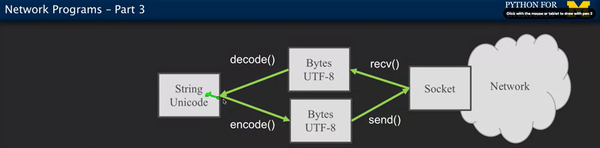

## Regular Expressions
1. `re.search`：返回第一個找到的項目。相當於 `re.find`。
2. `re.finadall`：搜索所有匹配的項目。
```py
import re
fh = open('regex_sum_1927563.txt')
content = fh.read()
regFh = re.findall('[0-9]+', content)
nums = 0
for i in regFh:
    nums += int(i)
print(nums)
```
:::tip
|RegEx|解釋|
|---|---|
|`a`|匹配字符串中的 "a"。|
|`^a`|匹配以 "a" 開頭項目。|
|`b$`|匹配以字母 "b" 結尾的字串。|
|`.`|匹配任何單個字符，如字串 "abc" 可以用 `a.c` 匹配整個字串。|
|`+`|表示前面的規則可以重複一次或多次，如 `a+` 將匹配 "a"、"aa"、"aaa" 等。|
|`+?`|非貪婪匹配，會將匹配的字符限制在最小可能的範圍，如 `a+?` 匹配 "aaa" 會只返回 "a"。|
|`*`|表示前面的規則可以重複 `0` 次或多次，用法跟 `+` 相同。|
|`*?`|非貪婪匹配。|
|`\s`|匹配空白字串，如 `^\s+` 可以匹配以空白開頭的字串。|
|`\S`|匹配非空白字串。|
|`[abc]`|匹配群組內任一字符。|
|`[^abc]`|匹配群組以外的字符。|
|`()`|分組，如 `(abc)+` 將匹配連續出現的 "abcabc"。|
:::

## Sockets
```py
import socket
# 創建 socket
mysock = socket.socket(socket.AF_INET, socket.SOCK_STREAM)
# 連結伺服器與端口
mysock.connect(('data.pr4e.org', 80))
cmd = 'GET http://data.pr4e.org/intro-short.txt HTTP/1.0\r\n\r\n'.encode()
mysock.send(cmd)

while True:
    # 每次接收最多 512 個字節的數據
    data = mysock.recv(512)
    if len(data) < 1:
        break
    print(data.decode(),end='')

mysock.close()
```
下圖為 `Python for everybody` 課程影片截圖，用繪圖的方式方常快速理解 socket 和上述程式碼在網路溝通中扮演的角色。

")

## Unicode
### ASCII
早期常用的字符編碼方式，以 128 個數字聯繫了 26 個大寫字母、26 個小寫字母、10 個數字、標點符號、控制字符等。每個字符都有一個唯一的 7 位二進制編碼，這樣的設計使得 ASCII 字符可以直接映射到一個字節（byte，8 位）的二進制數據中。


:::tip
這也說明了為什麼 `print('H' < 'h')` 會得到 `True`，因為代表 h 的數字是 104，大於 H 的 72。
```py
print(ord('H'))
# 72
```
:::

### Unicode
解決 ASCII 無法儲存其他語系字符的問題。`UTF-8` 是現在常用的編碼方式。  
下圖解釋了為何上述程式碼需要進行 `encode` 和 `decode`。



## Urllib + BeautifulSoup
Urllib 是 Python 的一個標準庫，專門用來爬取網頁資源。  
BeautifulSoup 則是 Python 用來解析獲得的 HTML 或 XML 資料的 library。

```bash title='先安裝 BeautifulSoup'
pip install beautifulsoup4
```

```py
from urllib.request import urlopen
from bs4 import BeautifulSoup
import ssl

# Ignore SSL certificate errors
ctx = ssl.create_default_context()
ctx.check_hostname = False
ctx.verify_mode = ssl.CERT_NONE

url = "http://py4e-data.dr-chuck.net/comments_42.html"
html = urlopen(url, context=ctx).read()
soup = BeautifulSoup(html, "html.parser")

tags = soup('span')
total = 0
for tag in tags:
    try:
        num = int(tag.contents[0])
        total += num
    except:
        continue
print(total)
```

## XML
早期泛用的跨平台間的交換數據格式，長得跟 HTML 很像，現在依舊有部分平台或伺服器沿用 XML 做資料傳輸。  
在 Python 中可以利用 [`xml.etree.ElementTree`](https://docs.python.org/3/library/xml.etree.elementtree.html) 來把 XML 解析成 element tree (就像 HTML 可以解析成 DOM tree) 來方便做資料的解析。

```py
import urllib.request, urllib.parse, urllib.error
import ssl
import xml.etree.ElementTree as ET

ctx = ssl.create_default_context()
ctx.check_hostname = False
ctx.verify_mode = ssl.CERT_NONE

url = 'http://py4e-data.dr-chuck.net/comments_1927567.xml'
data = urllib.request.urlopen(url, context=ctx).read()

tree = ET.fromstring(data)
counts = tree.findall('.//count')
total = 0
for count in counts:
    total += int(count.text)
print(total)
```

## JSON
現在較泛用的跨平台資料交換格式，因為比 XML 更加輕量與便於解析，所以使用率超越 XML。  
在 Python 中可以透過 `json` 套件來解析 JSON。

```py
import urllib.request, urllib.parse, urllib.error
import ssl
import json

ctx = ssl.create_default_context()
ctx.check_hostname = False
ctx.verify_mode = ssl.CERT_NONE

url = 'http://py4e-data.dr-chuck.net/comments_1927568.json'
data = urllib.request.urlopen(url, context=ctx).read()
info = json.loads(data)

total = 0
for item in info['comments']:
    total += item['count']
print(total)
```

## 課程總結
網路間的溝通，綜合以上從 socket 到 JSON，大致可以把流程歸納如下：  
1. 資料要送出去時還是 XML 或 JSON，先轉為 Unicode，再 encode 成 bytes。
2. 透過 socket 將請求或資料送出。
3. 接收方收到後，將 bytes 給解碼成 Unicode，在解析成 XML 或 JSON。
:::warning
或許會有疑問為何使用 Urllib 時也沒寫到 socket，但一樣能取回資料？  
那是因為 socket 是很底層的邏輯，當使用 Urllib 這個套件時，其實 socket 的邏輯已經封裝在裡面了。
:::

## 參考資料
1. [Programming for Everybody](https://www.coursera.org/specializations/python)