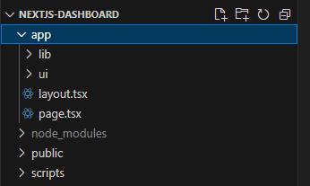
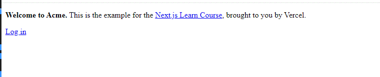
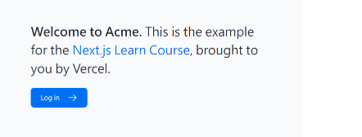
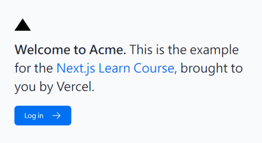
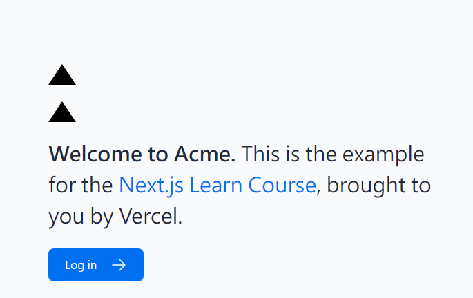
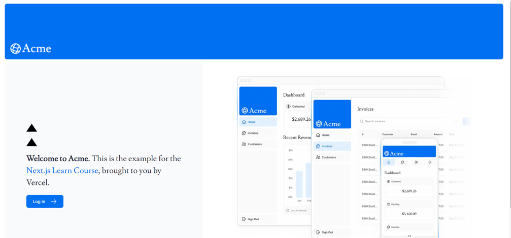

## 專案啟動
### 安裝官方配置好的專案
```powershell
npx create-next-app@latest nextjs-dashboard --use-npm --example "https://github.com/vercel/next-learn/tree/main/dashboard/starter-example"
```
### 打開專案
```powershell
code nextjs-dashboard
```

### 資料夾結構



官方教學示範資料夾結構如下：
```xml
---| app/
------| app/lib
------| app/ui
---| public
---| scripts
```

* `/app`: 包含所有的路由、組件和邏輯，是主要工作的地方。
* `/app/lib`: 包含可以複用的函數。(另外，官方在 **/app/lib/placeholder-data.js** 有放一組可以實驗用的假資料 placeholder data)
* `/app/ui`: 包含應用程式的所有 UI 元件，如卡片、表格和表單。(官方教學已準備好幾個元件)
* `/public`: 包含應用程式的所有靜態資源，如圖片。
* `/scripts`: 用於填充資料庫的種子腳本。(之後官方教學會用到)

### 啟動專案
1. 安裝依賴套件
```powershell
npm i
```
2. 啟動預覽
```powershell
npm run dev
```



## CSS 樣式
### 全域樣式
```xml
---| app/
------| app/ui
---------| app/ui/global.css
------| /app/layout.tsx
```
在 root layout (/app/layout.tsx) 引入全域樣式：
```tsx
// highlight-next-line
import '@/app/ui/global.css';
 
export default function RootLayout({
  children,
}: {
  children: React.ReactNode;
}) {
  return (
    <html lang="en">
      <body>{children}</body>
    </html>
  );
}
```


### 撰寫樣式
#### Option 1 - Tailwind CSS
如官方範例，會產生一個黑色三角形：
```tsx title='/app/page.tsx'
<div
  className="h-0 w-0 border-b-[30px] border-l-[20px] border-r-[20px] border-b-black border-l-transparent border-r-transparent"
/>
```



#### Option 2 - CSS Modules
```xml
---| app/
------| app/ui
---------| app/ui/home.module.css
```
根據官方說明：**CSS Modules allow you to scope CSS to a component by automatically creating unique class names**。因此使用 **CSS module** 不需要擔心樣式會起衝突。

如上述 Tailwind CSS 一樣產生黑色三角形：
1. 新增 **app/ui/home.module.css**：
```css
.shape {
  height: 0;
  width: 0;
  border-bottom: 30px solid black;
  border-left: 20px solid transparent;
  border-right: 20px solid transparent;
}
```
2. **/app/page.tsx** 引用：
```tsx
import styles from '@/app/ui/home.module.css';
<div className={styles.shape} />;
```



### 使用 **clcx** 動態轉換 class
如官方範例，根據 status 的值動態改變 class：

```tsx title='/app/ui/invoices/status.tsx'
import clsx from 'clsx';
 
export default function InvoiceStatus({ status }: { status: string }) {
  return (
    <span
    {/* highlight-start */}
      className={clsx(
        'inline-flex items-center rounded-full px-2 py-1 text-sm',
        {
          'bg-gray-100 text-gray-500': status === 'pending',
          'bg-green-500 text-white': status === 'paid',
        },
      )}
      {/* highlight-end */}
    >
    // ...
)}
```

## 字體
### 建立主要字體
```xml
---| app/
------| app/ui
---------| app/ui/fonts.ts
------| app/layout.tsx
```
1. 建立一個專門引入字型並管理的 **fonts.ts**：
```ts
import { Inter } from 'next/font/google';
 
export const inter = Inter({ subsets: ['latin'] });
```
2. 在 **/app/layout.tsx** 中做使用：
```tsx
import '@/app/ui/global.css';
// highlight-next-line
import { inter } from '@/app/ui/fonts';

export default function RootLayout({
  children,
}: {
  children: React.ReactNode;
}) {
  return (
    <html lang="en">
{/* highlight-next-line */}
      <body className={`${inter.className} antialiased`}>{children}</body>
    </html>
  );
}
```
:::info
**antialiased** 是 Tailwind 提供讓文字邊緣更平滑、柔和細膩的設定。
:::

:::note
#### 練習題
新增一個 **Lusitana** 字體並應用在 **page.tsx** 的 `<p>` 上：
1. 先在 **fonts.ts** 引入：
```ts
import { Inter, Lusitana } from 'next/font/google';
 
export const inter = Inter({ subsets: ['latin'] });
// highlight-start
export const lusitana = Lusitana({
    subsets: ['latin'],
    weight: '400'
});
// highlight-end
```
2. 在 **/app/page.tsx** 做使用：
```tsx
import AcmeLogo from '@/app/ui/acme-logo';
import { ArrowRightIcon } from '@heroicons/react/24/outline';
import Link from 'next/link';
// highlight-next-line
import { lusitana } from '@/app/ui/fonts';
 
export default function Page() {
  return (
    // ...
    // highlight-start
    <p
      className={`${lusitana.className} text-xl text-gray-800 md:text-3xl md:leading-normal`}
    >
    {/* highlight-end */}
      <strong>Welcome to Acme.</strong> This is the example for the{' '}
      <a href="https://nextjs.org/learn/" className="text-blue-500">
        Next.js Learn Course
      </a>
      , brought to you by Vercel.
    </p>
    // ...
  );
}
```
:::

## 圖片
```xml
---| app/
---| public
```
**public** 資料夾存放靜態檔案，包括圖片，在這個資料夾的圖片在使用 `` 做引用時可以直接使用 **/ + 檔名**：
```html

```

### `<Image>` 元件
這是 Next 基於 `` 延伸開發的元件，按官方說明，此元件提供下述優化：
* 防止圖片載入時自動造成的佈局移動。
* 根據設備視窗大小調整圖片尺寸，避免向小視窗設備發送過大的圖片。
* 預設啟用圖片的延遲加載（lazy load，當圖片進入視窗時才加載）。
* 當瀏覽器支援時，提供現代格式（如 WebP 和 AVIF）的圖片。


`<Image>` 在使用上必須先引入元件，如官方範例：
```tsx title='/app/page.tsx'
import AcmeLogo from '@/app/ui/acme-logo';
import { ArrowRightIcon } from '@heroicons/react/24/outline';
import Link from 'next/link';
import { lusitana } from '@/app/ui/fonts';
// highlight-next-line
import Image from 'next/image';
 
export default function Page() {
  return (
    // ...
    <div className="flex items-center justify-center p-6 md:w-3/5 md:px-28 md:py-12">
      {/* Add Hero Images Here */}
      {/* highlight-start */}
      <Image
        src="/hero-desktop.png"
        width={1000}
        height={760}
        className="hidden md:block"
        alt="Screenshots of the dashboard project showing desktop version"
      />
      {/* highlight-end */}
    </div>
    //...
  );
}
```
