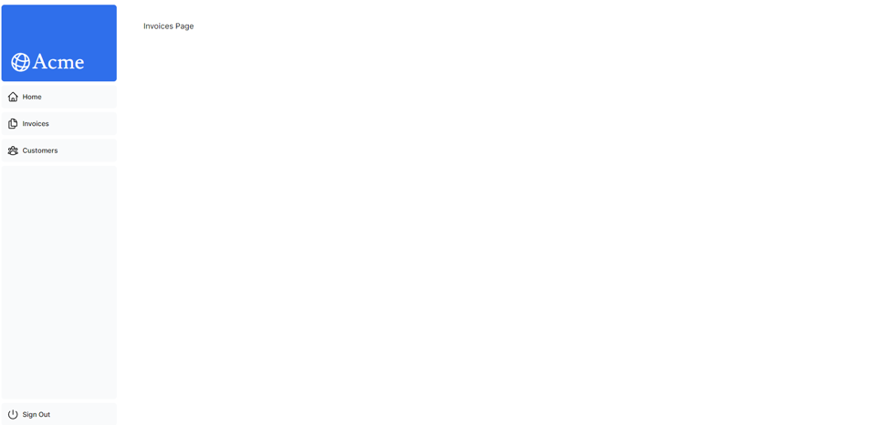
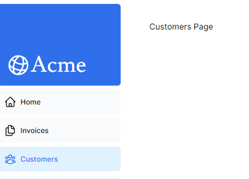

## Layouts 與 pages

### 巢狀路由
```xml
---| app/
------| /app/dashboard/
---------| /app/dashboard/invoices
```

每個 **page.tsx** 都代表一個頁面，如 **/app/page.tsx** 代表主頁，對應的路由是 **/**。  
同理，在 **dashboard** 資料夾中也建立一個 **page.tsx**，就可以形成路由 **/dashboard**。  
在 **invoices** 中又建立一個 **page.tsx** 就會形成巢狀路由 **/dashboard/invoices**。

### 新增一個頁面
實作在 **/app** 下面新增一個資料夾 **dashboard** 並在其中新增 **page.tsx**，這樣就可以形成 **/dashboard** 這個路由與頁面：
```tsx title='/app/dashboard/page.tsx'
export default function Page() {
  return <p>Dashboard Page</p>;
}
```

### 新增一個 layout
```xml
---| app/
------| /app/dashboard/
---------| /app/dashboard/invoices
---------| /app/dashboard/customers
```
依官方範例，若在 **dashboard** 新增一個 **layout.tsx**：
```tsx title='/app/dashboard/layout.tsx'
import SideNav from '@/app/ui/dashboard/sidenav';
 
export default function Layout({ children }: { children: React.ReactNode }) {
  return (
    <div className="flex h-screen flex-col md:flex-row md:overflow-hidden">
      <div className="w-full flex-none md:w-64">
        <SideNav />
      </div>
      <div className="flex-grow p-6 md:overflow-y-auto md:p-12">{children}</div>
    </div>
  );
}
```
則此佈局套用到 **dashboard** 往下層次的頁面與佈局。



### Root layout
在最上層的 lauout，也就是 **/app/layout.tsx**，又叫做 root layout，他是一個**必須**得存在的佈局，用來調整 `<html>` 跟 `<body>`。

```tsx title='/app/layout.tsx'
import '@/app/ui/global.css';
import { inter } from '@/app/ui/fonts';
 
export default function RootLayout({
  children,
}: {
  children: React.ReactNode;
}) {
  return (
    <html lang="en">
      <body className={`${inter.className} antialiased`}>{children}</body>
    </html>
  );
}
```

## 路由導航
### `<Link>` 元件
Next 提供 `<Link>` 元件來取代 `<a>` 在客戶端做路由導航。  

```tsx title='/app/ui/dashboard/nav-links.tsx'
import {
  UserGroupIcon,
  HomeIcon,
  DocumentDuplicateIcon,
} from '@heroicons/react/24/outline';
// highlight-next-line
import Link from 'next/link';
 
// ...
 
export default function NavLinks() {
  return (
    <>
      {links.map((link) => {
        const LinkIcon = link.icon;
        return (
            {/* highlight-start */}
          <Link
            key={link.name}
            href={link.href}
            className="flex h-[48px] grow items-center justify-center gap-2 rounded-md bg-gray-50 p-3 text-sm font-medium hover:bg-sky-100 hover:text-blue-600 md:flex-none md:justify-start md:p-2 md:px-3"
          >
            <LinkIcon className="w-6" />
            <p className="hidden md:block">{link.name}</p>
          </Link>
          {/* highlight-end */}
        );
      })}
    </>
  );
}
```
:::info
我覺得官方說的這一段非常有趣：
> Furthermore, in production, whenever `<Link>` components appear in the browser's viewport, Next.js automatically prefetches the code for the linked route in the background. By the time the user clicks the link, the code for the destination page will already be loaded in the background, and this is what makes the page transition near-instant!
:::

### 顯示 active links (`usePathname()`)
如果需求在畫面上顯示當前路由，或需求當前路由做一些事情 (比如下判別式)，可以使用 Next 提供的 `usePathname()` hook。  
但因為 `usePathname()` 是個 hook，因此必須在元件前面加上 **'use client'** 宣告它是個 **client component** (Next 預設是 server component)。

依官方範例，就是依照現在所在路由來改變畫面的顏色：
```tsx title='/app/ui/dashboard/nav-links.tsx'
// highlight-next-line
'use client';

import {
  UserGroupIcon,
  HomeIcon,
  InboxIcon,
} from '@heroicons/react/24/outline';
import Link from 'next/link';
// highlight-start
import { usePathname } from 'next/navigation';
import clsx from 'clsx';
// highlight-end

export default function NavLinks() {
    // highlight-next-line
  const pathname = usePathname();
 
  return (
    <>
      {links.map((link) => {
        const LinkIcon = link.icon;
        return (
          <Link
            key={link.name}
            href={link.href}
            {/* highlight-start */}
            className={clsx(
              'flex h-[48px] grow items-center justify-center gap-2 rounded-md bg-gray-50 p-3 text-sm font-medium hover:bg-sky-100 hover:text-blue-600 md:flex-none md:justify-start md:p-2 md:px-3',
              {
                'bg-sky-100 text-blue-600': pathname === link.href,
              },
            )}
            {/* highlight-end */}
          >
            <LinkIcon className="w-6" />
            <p className="hidden md:block">{link.name}</p>
          </Link>
        );
      })}
    </>
  );
}
```

