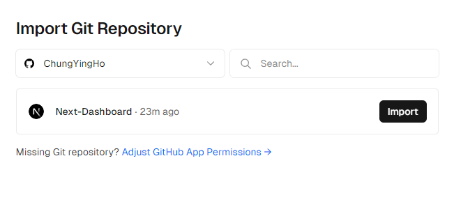
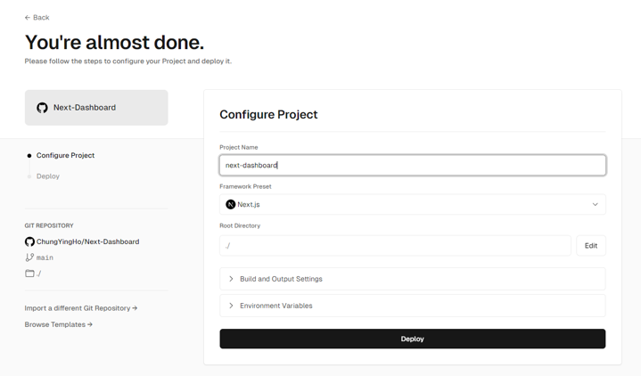
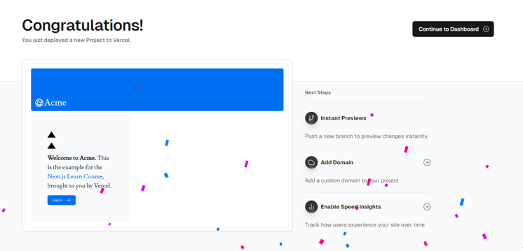
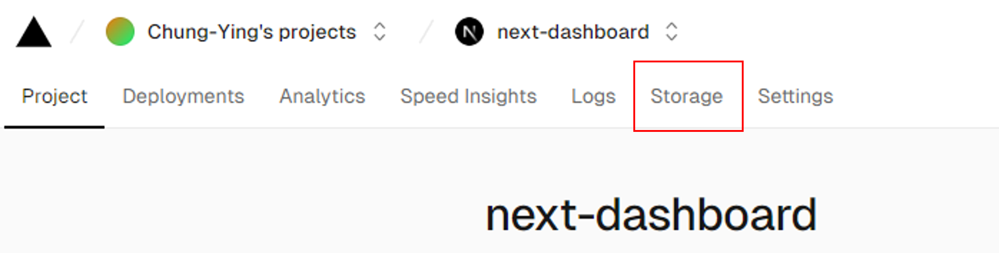
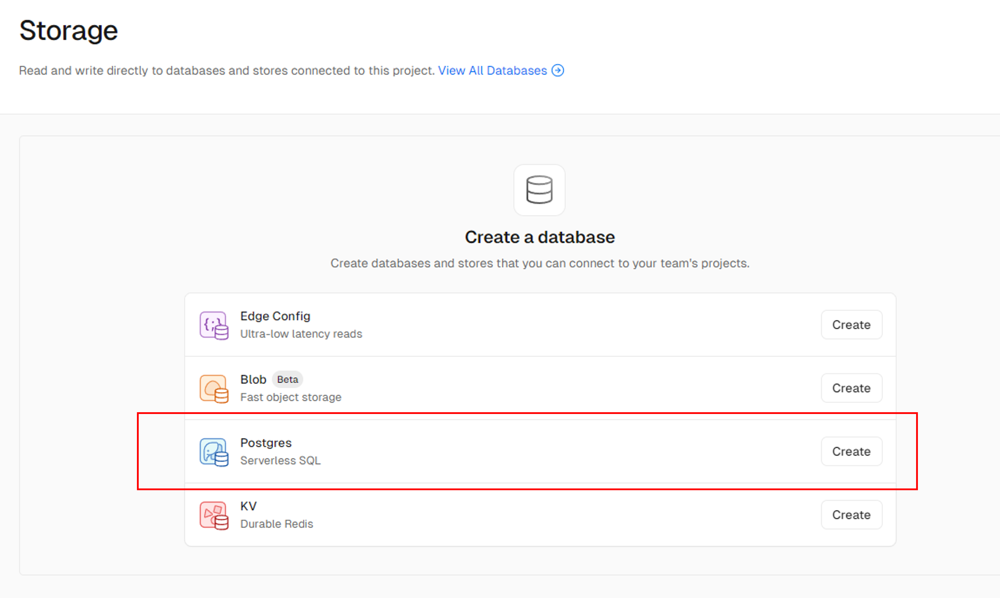
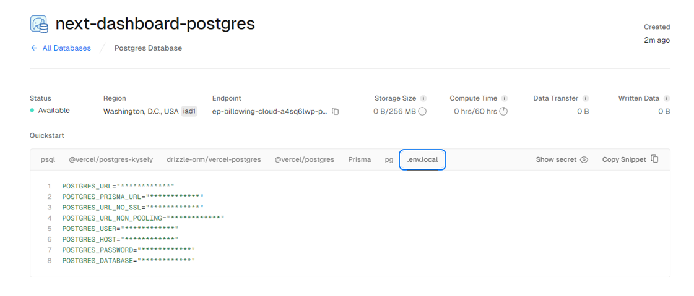
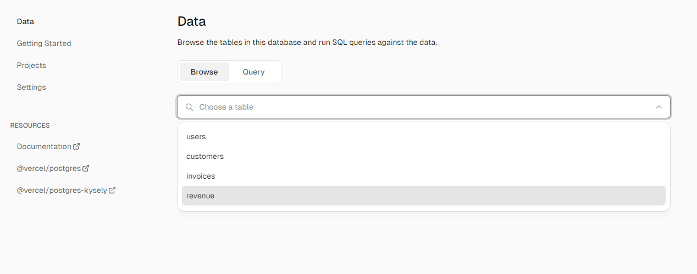
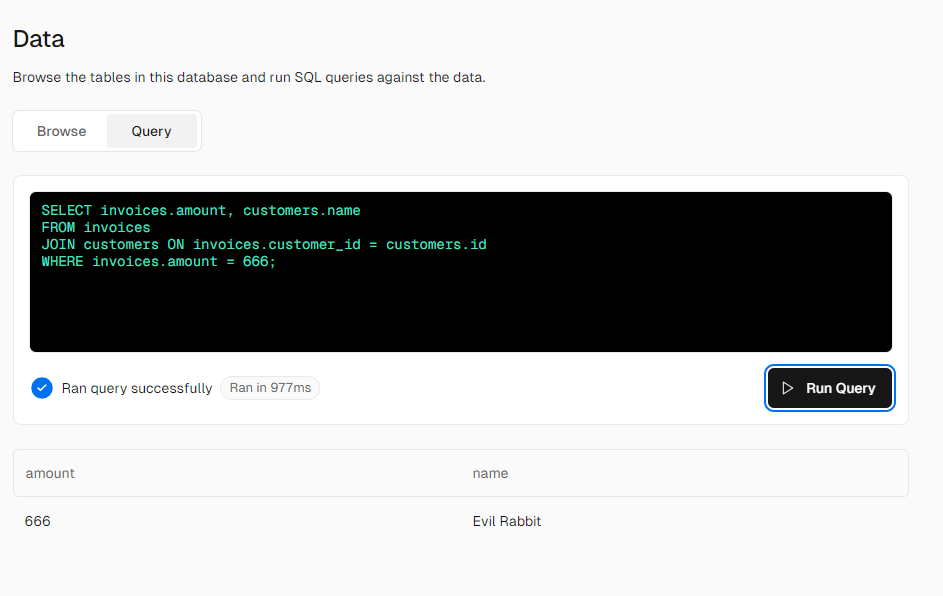
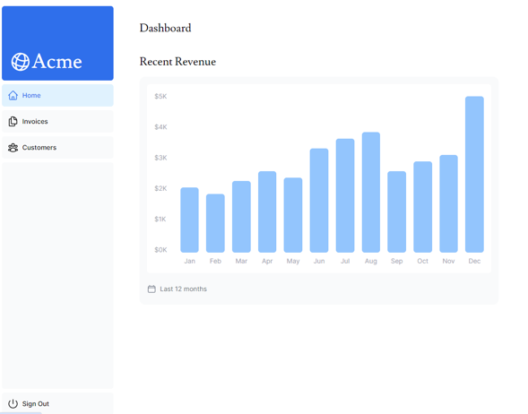
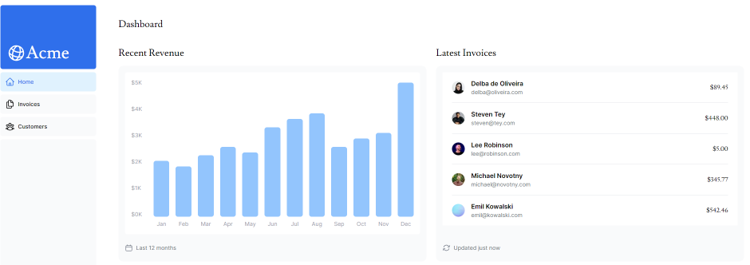

## 建立 Vercel 帳號
:::warning
這裡默認已經有 GitHub 帳號並把之前的練習上傳到 GitHub repo 上了。
:::
[Vercel](https://vercel.com/signup) 選擇 **hobby** 免費方案，使用 GitHub 登入即可。



### Vercel 部署
辦完 Vercel 帳號後可以直接連通 GitHub repo，import 專案後可以直接一鍵部署。




## 建立 Postgres database
### 建立與連接資料庫
1. 部署完成後，點選 **Continue to Dashboard**，選擇 **Storage**，接著前往下列路徑 **Postgres → Create**。當創建完成後，點擊 **Connect** 連結資料庫。




2. 接著點擊前往 **.env.local**，點擊 **Show secret** 跟 **Copy Snippet**。



3. 回到本地專案中，找到預設的 **.env.example** 檔案改成 **.env** 並貼上剛剛複製的內容。
:::warning
確保 **.env** 檔案有被加入 **.gitignore** 中。
:::
4. 安裝 Vercel Postgres SDK：
```powershell
npm i @vercel/postgres
```

### 建立種子資料
在專案中的 **scripts** 資料夾，找到 **seed.js** 檔案，裡面已經有 Next 官方製作好用來產生種子資料的指令。  
接下來前往 **package.json** 增加一段指令：
```json
"scripts": {
  "build": "next build",
  "dev": "next dev",
  "start": "next start",
//   highlight-next-line
  "seed": "node -r dotenv/config ./scripts/seed.js"
},
```

現在可以回到 Vercel，在側欄找到 **Data**，就可以瀏覽剛剛建立的表格了。



:::info
在 **Data** 中，切換到 **Query**，可以執行 SQL 指令，可以依官方範例執行：
```sql
SELECT invoices.amount, customers.name
FROM invoices
JOIN customers ON invoices.customer_id = customers.id
WHERE invoices.amount = 666;
```


:::

## 在 Next 中獲取資料
在 Next 中，打 API 獲取資料的方式會隨 **client component** 還是 **server component** 而有所不同：
* **client component**：需要在 Route Handlers 中執行打 API。
* **server component**：因為是在伺服器上執行，所以可以直接查詢資料庫，而無需額外打 API。

在官方教學範例中，Next 官方選擇不在每個 server component 中做 SQL 操作，而是統一在 **/app/lib/data.ts** 做操作管理：
```ts
import { sql } from '@vercel/postgres';
 
// ...
```

#### 按照官方教學做資料獲取：
以下是官方提供的程式碼，先直接 copy 覆蓋本地專案原有的 code，可以觀察到這是一個 **async component**，這可以讓接下來引用的組件使用 **await** 獲取資料：
```tsx title='/app/dashboard/page.tsx'
import { Card } from '@/app/ui/dashboard/cards';
import RevenueChart from '@/app/ui/dashboard/revenue-chart';
import LatestInvoices from '@/app/ui/dashboard/latest-invoices';
import { lusitana } from '@/app/ui/fonts';
 
// highlight-next-line
export default async function Page() {
  return (
    <main>
      <h1 className={`${lusitana.className} mb-4 text-xl md:text-2xl`}>
        Dashboard
      </h1>
      <div className="grid gap-6 sm:grid-cols-2 lg:grid-cols-4">
        {/* <Card title="Collected" value={totalPaidInvoices} type="collected" /> */}
        {/* <Card title="Pending" value={totalPendingInvoices} type="pending" /> */}
        {/* <Card title="Total Invoices" value={numberOfInvoices} type="invoices" /> */}
        {/* <Card
          title="Total Customers"
          value={numberOfCustomers}
          type="customers"
        /> */}
      </div>
      <div className="mt-6 grid grid-cols-1 gap-6 md:grid-cols-4 lg:grid-cols-8">
        {/* <RevenueChart revenue={revenue}  /> */}
        {/* <LatestInvoices latestInvoices={latestInvoices} /> */}
      </div>
    </main>
  );
}
```

#### 獲取 `<RevenueChart/>` 需要的資料：
```tsx title='/app/dashboard/page.tsx'
import { Card } from '@/app/ui/dashboard/cards';
import RevenueChart from '@/app/ui/dashboard/revenue-chart';
import LatestInvoices from '@/app/ui/dashboard/latest-invoices';
import { lusitana } from '@/app/ui/fonts';
// highlight-next-line
import { fetchRevenue } from '@/app/lib/data';
 
export default async function Page() {
    // highlight-next-line
  const revenue = await fetchRevenue();
  // ...
}
```
接下來把 **/app/dashboard/page.tsx** 中的 `<RevenueChart/>` 解除註解，並把 **/app/ui/dashboard/revenue-chart.tsx** 的程式碼也解除註解，就可以再畫面上看到精美的圖表。




#### 獲取 `<LatestInvoices />` 需要的資料：
```tsx title='/app/dashboard/page.tsx'
import { Card } from '@/app/ui/dashboard/cards';
import RevenueChart from '@/app/ui/dashboard/revenue-chart';
import LatestInvoices from '@/app/ui/dashboard/latest-invoices';
import { lusitana } from '@/app/ui/fonts';
// highlight-next-line
import { fetchRevenue, fetchLatestInvoices } from '@/app/lib/data';
 
export default async function Page() {
  const revenue = await fetchRevenue();
  // highlight-next-line
  const latestInvoices = await fetchLatestInvoices();
  // ...
}
```
取消註解 `<LatestInvoices />` 以及 **/app/ui/dashboard/latest-invoices** 中的 code。



:::info
<details>
<summary>官方完整程式碼</summary>

```tsx title='/app/dashboard/page.tsx'
import { Card } from '@/app/ui/dashboard/cards';
import RevenueChart from '@/app/ui/dashboard/revenue-chart';
import LatestInvoices from '@/app/ui/dashboard/latest-invoices';
import { lusitana } from '@/app/ui/fonts';
import {
  fetchRevenue,
  fetchLatestInvoices,
  fetchCardData,
} from '@/app/lib/data';
 
export default async function Page() {
  const revenue = await fetchRevenue();
  const latestInvoices = await fetchLatestInvoices();
  const {
    numberOfInvoices,
    numberOfCustomers,
    totalPaidInvoices,
    totalPendingInvoices,
  } = await fetchCardData();
 
  return (
    <main>
      <h1 className={`${lusitana.className} mb-4 text-xl md:text-2xl`}>
        Dashboard
      </h1>
      <div className="grid gap-6 sm:grid-cols-2 lg:grid-cols-4">
        <Card title="Collected" value={totalPaidInvoices} type="collected" />
        <Card title="Pending" value={totalPendingInvoices} type="pending" />
        <Card title="Total Invoices" value={numberOfInvoices} type="invoices" />
        <Card
          title="Total Customers"
          value={numberOfCustomers}
          type="customers"
        />
      </div>
      <div className="mt-6 grid grid-cols-1 gap-6 md:grid-cols-4 lg:grid-cols-8">
        <RevenueChart revenue={revenue} />
        <LatestInvoices latestInvoices={latestInvoices} />
      </div>
    </main>
  );
}
```
</details>
:::