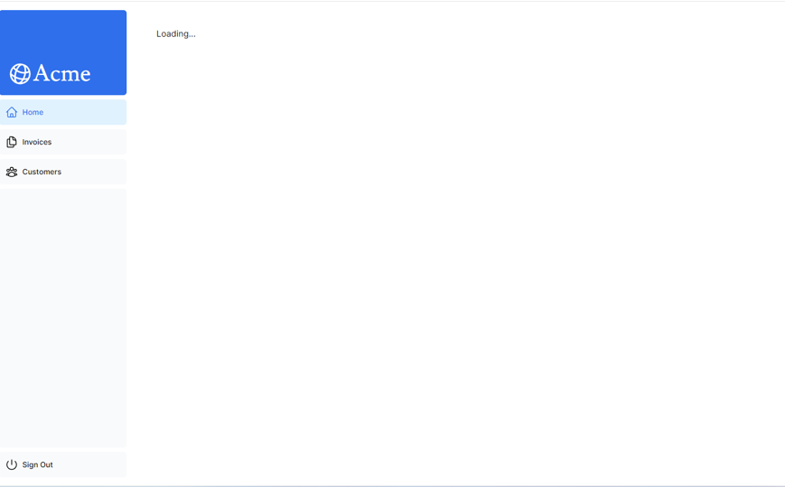
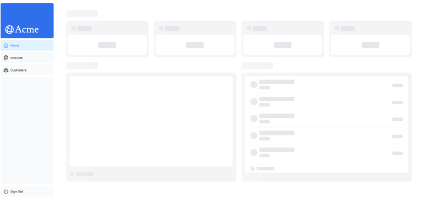
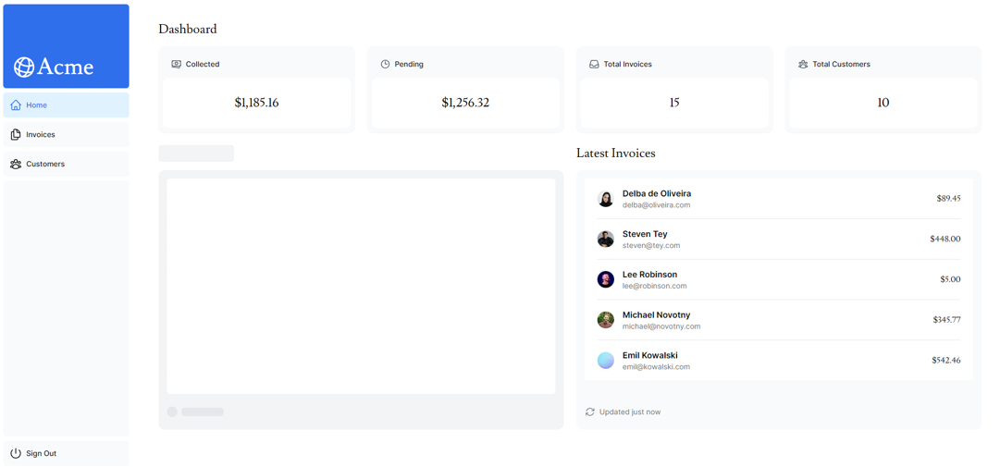
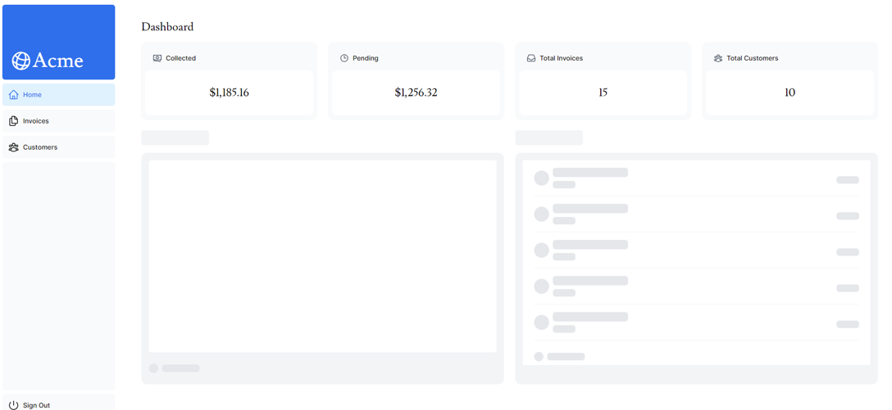

## Static Rendering
靜態渲染適用於沒有數據或數據是所有用戶共享的 UI，如部落格或商品頁面。  
靜態渲染是在部署（或重新驗證時）的建構階段在伺服器上進行數據獲取和渲染，結果可分發在內容傳遞網絡（CDN）中緩存。
:::info
[CDN是什麼？| CDN 的工作原理及用途](https://www.cloudflare.com/zh-tw/learning/cdn/what-is-a-cdn/)
:::

官方範例提到靜態渲染透過緩存主要帶來下列益處：
1. 速度更快的網站。
2. 降低伺服器負擔。
3. 提高 SEO。

## Dynamic Rendering
動態渲染適用於需要即時數據或個人化內容的網頁，能夠根據用戶的具體需求來定制內容和提供實時資訊。  
所以動態渲染是在**用戶請求時 (當用戶訪問頁面時)** 才在伺服器上渲染內容。

具體來說，動態渲染就是隨著使用者互動而改變渲染內容的方法。

### 製作動態渲染頁面
只要在 server component 或獲取資料的函式中使用 Next 提供的 **unstable_noStore** API 就可以退出靜態渲染改用動態渲染。  
官方範例是使用在 **data.ts** 中：
```ts title='/app/lib/data.ts'
// ...
// highlight-next-line
import { unstable_noStore as noStore } from 'next/cache';
 
export async function fetchRevenue() {
  // Add noStore() here to prevent the response from being cached.
  // This is equivalent to in fetch(..., {cache: 'no-store'}).
  // highlight-next-line
  noStore();
 
  // ...
}
 
export async function fetchLatestInvoices() {
    // highlight-next-line
  noStore();
  // ...
}
// ...
```

## Streaming
動態渲染有個問題，因為它會即時請求資訊回來做渲染，因此若請求耗費時間過長就會造成渲染問題，導致使用者體驗不佳。  
Next 中可以使用 streaming 來解決上述問題，根據 Next 的官方解釋翻譯，streaming（串流）是一種數據傳輸技術，可以將一個請求的數據分割成多個較小的部分 (chunks)，並隨著這些部分準備好後，逐步從服務器端傳輸到客戶端。因此可以避免因為慢速的數據請求而阻塞整個頁面的加載，從而讓用戶在等待所有數據加載完成之前，就能看到並與頁面的某些部分進行互動。

Next 中有兩種辦法可以做到 streaming：
1. **loading.tsx**
2. `<Suspense>`

:::info
在繼續之前，先改一下 code 模擬慢速請求。

```ts title='/app/lib/data.ts'
export async function fetchRevenue() {
  try {
    // We artificially delay a response for demo purposes.
    // Don't do this in production :)
    // highlight-start
    console.log('Fetching revenue data...');
    await new Promise((resolve) => setTimeout(resolve, 3000));
    // highlight-end
 
    const data = await sql<Revenue>`SELECT * FROM revenue`;
    // highlight-next-line
    console.log('Data fetch completed after 3 seconds.');
 
    return data.rows;
  } catch (error) {
    console.error('Database Error:', error);
    throw new Error('Failed to fetch revenue data.');
  }
}
```
:::

### **loading.tsx** - Streaming a whole page
講白了就是做一個 loading page 來讓使用者在資料回來前先能看到一個畫面。

```tsx title='/app/dashboard/loading.tsx'
export default function Loading() {
  return <div>Loading...</div>;
}
```



也可以使用 loading skeletons：

```tsx title='/app/dashboard/loading.tsx'
import DashboardSkeleton from '@/app/ui/skeletons';
 
export default function Loading() {
  return <DashboardSkeleton />;
}
```



:::info
#### route groups
因為現在 **/app/dashboard/loading.tsx** 的層級在 **/invoices/page.tsx** 跟 **/customers/page.tsx** 之上，所以他們也都會套用到這個 loading page。  
如果只想把 loading page 應用在 **/dashboard** 這個路由，可以使用 **route groups**：

```xml
---| /dashboard
------| (overview)
---------| loading.tsx
---------| page.tsx
```

透過 **()** 包起來的資料夾名稱不會包含在 URL 路徑中，因此，**/dashboard/(overview)/page.tsx** 會被轉換成 **/dashboard** 的路由。
:::

## `<Suspense>` - Streaming a component
要做到僅 **Streaming a component**，有幾個關鍵：
1. 使用 `<Suspense>`
2. 將資料獲取改成在子元件中取

依官方範例：
1. 先把 `fetchRevenue()` 及相關資料移除：

```tsx title='/app/dashboard/(overview)/page.tsx'
import { Card } from '@/app/ui/dashboard/cards';
import RevenueChart from '@/app/ui/dashboard/revenue-chart';
import LatestInvoices from '@/app/ui/dashboard/latest-invoices';
import { lusitana } from '@/app/ui/fonts';
// highlight-next-line
import { fetchLatestInvoices, fetchCardData } from '@/app/lib/data'; // remove fetchRevenue
 
export default async function Page() {
  // highlight-next-line
  const revenue = await fetchRevenue // delete this line
  const latestInvoices = await fetchLatestInvoices();
  const {
    numberOfInvoices,
    numberOfCustomers,
    totalPaidInvoices,
    totalPendingInvoices,
  } = await fetchCardData();
 
  return (
    // ...
  );
}
```

2. 使用 `<Suspense>`

```tsx title='/app/dashboard/(overview)/page.tsx'
import { Card } from '@/app/ui/dashboard/cards';
import RevenueChart from '@/app/ui/dashboard/revenue-chart';
import LatestInvoices from '@/app/ui/dashboard/latest-invoices';
import { lusitana } from '@/app/ui/fonts';
import { fetchLatestInvoices, fetchCardData } from '@/app/lib/data';
// highlight-start
import { Suspense } from 'react';
import { RevenueChartSkeleton } from '@/app/ui/skeletons';
// highlight-end
 
export default async function Page() {
  const latestInvoices = await fetchLatestInvoices();
  const {
    numberOfInvoices,
    numberOfCustomers,
    totalPaidInvoices,
    totalPendingInvoices,
  } = await fetchCardData();
 
  return (
    <main>
      <h1 className={`${lusitana.className} mb-4 text-xl md:text-2xl`}>
        Dashboard
      </h1>
      <div className="grid gap-6 sm:grid-cols-2 lg:grid-cols-4">
        <Card title="Collected" value={totalPaidInvoices} type="collected" />
        <Card title="Pending" value={totalPendingInvoices} type="pending" />
        <Card title="Total Invoices" value={numberOfInvoices} type="invoices" />
        <Card
          title="Total Customers"
          value={numberOfCustomers}
          type="customers"
        />
      </div>
      <div className="mt-6 grid grid-cols-1 gap-6 md:grid-cols-4 lg:grid-cols-8">
        {/* highlight-start */}
        <Suspense fallback={<RevenueChartSkeleton />}>
          <RevenueChart />
        </Suspense>
        {/* highlight-end */}
        <LatestInvoices latestInvoices={latestInvoices} />
      </div>
    </main>
  );
}
```

3. 到子元件 `<RevenueChart>` 中做資料獲取：

```tsx title='/app/ui/dashboard/revenue-chart.tsx'
import { generateYAxis } from '@/app/lib/utils';
import { CalendarIcon } from '@heroicons/react/24/outline';
import { lusitana } from '@/app/ui/fonts';
// highlight-next-line
import { fetchRevenue } from '@/app/lib/data';
 
// ...
// highlight-start
export default async function RevenueChart() { // Make component async, remove the props
  const revenue = await fetchRevenue(); // Fetch data inside the component
// highlight-end
  const chartHeight = 350;
  const { yAxisLabels, topLabel } = generateYAxis(revenue);
 
  if (!revenue || revenue.length === 0) {
    return <p className="mt-4 text-gray-400">No data available.</p>;
  }
 
  return (
    // ...
  );
}
```
:::tip
想模擬延遲效果，比照上述去 **/app/lib/data.ts** 資料獲取函式添加 `await new Promise((resolve) => setTimeout(resolve, 3000))`
:::



:::note
#### 練習題 - Streaming `<LatestInvoices>`
```tsx title='/app/dashboard/(overview)/page.tsx'
import { Card } from '@/app/ui/dashboard/cards';
import RevenueChart from '@/app/ui/dashboard/revenue-chart';
import LatestInvoices from '@/app/ui/dashboard/latest-invoices';
import { lusitana } from '@/app/ui/fonts';
// highlight-next-line
import { fetchCardData } from '@/app/lib/data'; // Remove fetchLatestInvoices
import { Suspense } from 'react';
import {
  RevenueChartSkeleton,
// highlight-next-line
  LatestInvoicesSkeleton,
} from '@/app/ui/skeletons';
 
export default async function Page() {
  // highlight-next-line
  // Remove `const latestInvoices = await fetchLatestInvoices()`
  const {
    numberOfInvoices,
    numberOfCustomers,
    totalPaidInvoices,
    totalPendingInvoices,
  } = await fetchCardData();
 
  return (
    <main>
      <h1 className={`${lusitana.className} mb-4 text-xl md:text-2xl`}>
        Dashboard
      </h1>
      <div className="grid gap-6 sm:grid-cols-2 lg:grid-cols-4">
        <Card title="Collected" value={totalPaidInvoices} type="collected" />
        <Card title="Pending" value={totalPendingInvoices} type="pending" />
        <Card title="Total Invoices" value={numberOfInvoices} type="invoices" />
        <Card
          title="Total Customers"
          value={numberOfCustomers}
          type="customers"
        />
      </div>
      <div className="mt-6 grid grid-cols-1 gap-6 md:grid-cols-4 lg:grid-cols-8">
        <Suspense fallback={<RevenueChartSkeleton />}>
          <RevenueChart />
        </Suspense>
        {/* highlight-start */}
        <Suspense fallback={<LatestInvoicesSkeleton />}>
          <LatestInvoices />
        </Suspense>
        {/* highlight-end */}
      </div>
    </main>
  );
}
```
```tsx title='/app/ui/dashboard/latest-invoices.tsx'
import { ArrowPathIcon } from '@heroicons/react/24/outline';
import clsx from 'clsx';
import Image from 'next/image';
import { lusitana } from '@/app/ui/fonts';
// highlight-next-line
import { fetchLatestInvoices } from '@/app/lib/data';
 
//  highlight-start
export default async function LatestInvoices() { // Remove props
  const latestInvoices = await fetchLatestInvoices();
// highlight-end
  return (
    // ...
  );
}
```


:::

### Grouping components
```xml
<Card title="Collected" value={totalPaidInvoices} type="collected" />
<Card title="Pending" value={totalPendingInvoices} type="pending" />
<Card title="Total Invoices" value={numberOfInvoices} type="invoices" />
<Card
  title="Total Customers"
  value={numberOfCustomers}
  type="customers"
/>
```
這是目前 `<Card>` 元件的使用方式，如果要為每個 `<Card>` 元件加上 `<Suspense>` 然後為每個個別的卡片抓取數據，可能會造成當卡片加載進來時出現 **popping** 效果，可能影響用戶體驗。  
為了解決這個問題，Next 提出了 **Grouping components** 的解法。

1. 刪除原本的 `<Card>` 元件、`fetchCardData()` 函式，並做下列調整：
```tsx title='/app/dashboard/page.tsx'
// highlight-next-line
import CardWrapper from '@/app/ui/dashboard/cards';
// ...
import {
  RevenueChartSkeleton,
  LatestInvoicesSkeleton,
  // highlight-next-line
  CardsSkeleton,
} from '@/app/ui/skeletons';
 
export default async function Page() {
  return (
    <main>
      <h1 className={`${lusitana.className} mb-4 text-xl md:text-2xl`}>
        Dashboard
      </h1>
      <div className="grid gap-6 sm:grid-cols-2 lg:grid-cols-4">
        {/* highlight-start */}
        <Suspense fallback={<CardsSkeleton />}>
          <CardWrapper />
        </Suspense>
        {/* highlight-end */}
      </div>
      // ...
    </main>
  );
}
```

2. 在 **/app/ui/dashboard/cards.tsx** 裡面進行資料獲取：

```tsx title='/app/ui/dashboard/cards.tsx'
// ...
// highlight-next-line
import { fetchCardData } from '@/app/lib/data';
 
// ...
 
export default async function CardWrapper() {
  // highlight-start
  const {
    numberOfInvoices,
    numberOfCustomers,
    totalPaidInvoices,
    totalPendingInvoices,
  } = await fetchCardData();
  // highlight-end
 
  return (
    <>
      <Card title="Collected" value={totalPaidInvoices} type="collected" />
      <Card title="Pending" value={totalPendingInvoices} type="pending" />
      <Card title="Total Invoices" value={numberOfInvoices} type="invoices" />
      <Card
        title="Total Customers"
        value={numberOfCustomers}
        type="customers"
      />
    </>
  );
}
```

