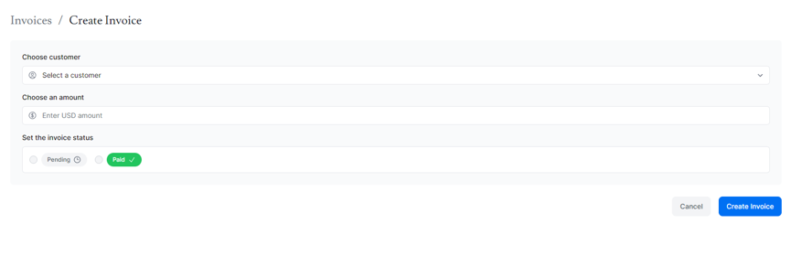
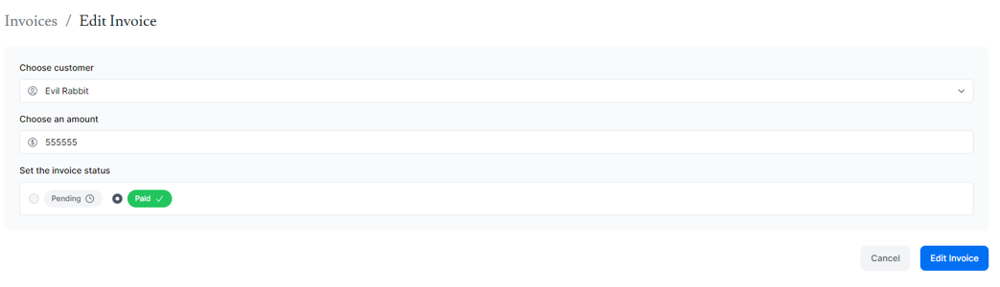

## Server Actions

React Server Actions 允許在 server 上執行非同步程式碼，這樣做有幾個好處：

1. 性能提升：通過將資料處理和操作保留在伺服器上，可以減少客戶端需要執行的工作量，從而改善應用的整體性能和響應速度。
2. 安全性加強：由於操作在伺服器上進行，這有助於更好地控制安全性和訪問權限。伺服器可以進行徹底的身份驗證和授權檢查，並且更容易防止潛在的安全漏洞。
3. 數據處理的集中化：伺服器操作使得數據處理邏輯可以集中在伺服器端，便於管理和維護。這對於需要與後端數據庫或其他服務交互的複雜應用尤其有益。

```tsx title='官方範例'
// Server Component
export default function Page() {
  // Action
  async function create(formData: FormData) {
    "use server";

    // Logic to mutate data...
  }
  //  highlight-start
  // Invoke the action using the "action" attribute
  return <form action={create}>...</form>;
  //   highlight-end
}
```

## Creating an invoice

### 新增一個新的路由和表格

```xml
---| invoices/
------| create/
---------| page.tsx
```

```tsx title='/dashboard/invoices/create/page.tsx'
import Form from "@/app/ui/invoices/create-form";
import Breadcrumbs from "@/app/ui/invoices/breadcrumbs";
import { fetchCustomers } from "@/app/lib/data";

export default async function Page() {
  const customers = await fetchCustomers();

  return (
    <main>
      <Breadcrumbs
        breadcrumbs={[
          { label: "Invoices", href: "/dashboard/invoices" },
          {
            label: "Create Invoice",
            href: "/dashboard/invoices/create",
            active: true,
          },
        ]}
      />
      <Form customers={customers} />
    </main>
  );
}
```

### 建立 Server Action

1. 定義 server function

```ts title='/app/lib/actions.ts'
// mark all the exported functions within the file as server functions
"use server";

export async function createInvoice(formData: FormData) {}
```

2. 在元件中引用成 server action

```tsx title='/app/ui/invoices/create-form.tsx'
import { customerField } from '@/app/lib/definitions';
import Link from 'next/link';
import {
  CheckIcon,
  ClockIcon,
  CurrencyDollarIcon,
  UserCircleIcon,
} from '@heroicons/react/24/outline';
import { Button } from '@/app/ui/button';
// highlight-next-line
import { createInvoice } from '@/app/lib/actions';

export default function Form({
  customers,
}: {
  customers: customerField[];
}) {
  return (
    // highlight-next-line
    <form action={createInvoice}>
      // ...
  )
}
```

### 抓取 formData 中的資料

```ts title='/app/lib/actions.ts'
"use server";

export async function createInvoice(formData: FormData) {
  const rawFormData = {
    customerId: formData.get("customerId"),
    amount: formData.get("amount"),
    status: formData.get("status"),
  };
  // Test it out:
  console.log(rawFormData);
}
```

### 驗證資料
再把資料送去資料庫前通常需要先驗證資料格式。  
以下是 invoices table 需求的資料格式：
```ts title='/app/lib/definitions.ts'
export type Invoice = {
  id: string; // Will be created on the database
  customer_id: string;
  amount: number; // Stored in cents
  status: 'pending' | 'paid';
  date: string;
};
```

在 Next 中，可以安裝套件 **Zod** 來幫助驗證：
```ts title='/app/lib/actions.ts'
'use server';

// highlight-next-line
import { z } from 'zod';
 
// highlight-start
const FormSchema = z.object({
  id: z.string(),
  customerId: z.string(),
  amount: z.coerce.number(),
  status: z.enum(['pending', 'paid']),
  date: z.string(),
});
// highlight-end

// highlight-next-line
const CreateInvoice = FormSchema.omit({ id: true, date: true });
 
export async function createInvoice(formData: FormData) {
  // highlight-next-line
  const { customerId, amount, status } = CreateInvoice.parse({
    customerId: formData.get('customerId'),
    amount: formData.get('amount'),
    status: formData.get('status'),
  });
  const amountInCents = amount * 100;
  const date = new Date().toISOString().split('T')[0];
}
```

### 把資料放進資料庫
```ts title='/app/lib/actions.ts'
import { z } from 'zod';
// highlight-next-line
import { sql } from '@vercel/postgres';
 
// ...
 
export async function createInvoice(formData: FormData) {
  const { customerId, amount, status } = CreateInvoice.parse({
    customerId: formData.get('customerId'),
    amount: formData.get('amount'),
    status: formData.get('status'),
  });
  const amountInCents = amount * 100;
  const date = new Date().toISOString().split('T')[0];
 
//  highlight-start
  await sql`
    INSERT INTO invoices (customer_id, amount, status, date)
    VALUES (${customerId}, ${amountInCents}, ${status}, ${date})
  `;
// highlight-end
}
```
:::warning
這一步做完有錯誤出現是正常的，官方教學在下一張才是做錯誤處理。  
這裡先把 revalidate and redirect 做完就不會有錯誤了。
:::

### Revalidate and redirect
因為現在新增了一筆資料，通常會希望渲染也跟著變動，所以會需要清除 client-side router 的緩存，重新從伺服器抓資料：
```ts title='/app/lib/actions.ts'
'use server';
 
import { z } from 'zod';
import { sql } from '@vercel/postgres';
// highlight-start
import { revalidatePath } from 'next/cache';
import { redirect } from 'next/navigation';
// highlight-end
// ...
 
export async function createInvoice(formData: FormData) {
  const { customerId, amount, status } = CreateInvoice.parse({
    customerId: formData.get('customerId'),
    amount: formData.get('amount'),
    status: formData.get('status'),
  });
  const amountInCents = amount * 100;
  const date = new Date().toISOString().split('T')[0];
 
  await sql`
    INSERT INTO invoices (customer_id, amount, status, date)
    VALUES (${customerId}, ${amountInCents}, ${status}, ${date})
  `;
 
//  highlight-start
  revalidatePath('/dashboard/invoices');
  redirect('/dashboard/invoices');
//   highlight-end
}
```



## Updating an invoice
如果需求是更新 invoices，會需要傳送 invoices 的 `id` 至資料庫才能做更新，所以這段的重點在如何抓 `id`。

### 建立動態路由
1. 先建立如下的資料夾格式：
```xml
---| invoices
------| [id]
---------| edit
------------| page.tsx
```

2. 觀察到 `<Table>` 元件中有一個 `<UpdateInvoice />` 元件在接收 invoices 的 `id`：
```tsx title='/app/ui/invoices/table.tsx'
export default async function InvoicesTable({
  query,
  currentPage,
}: {
  query: string;
  currentPage: number;
}) {
  return (
    // ...
    <td className="flex justify-end gap-2 whitespace-nowrap px-6 py-4 text-sm">
        {/* highlight-start */}
      <UpdateInvoice id={invoice.id} />
      <DeleteInvoice id={invoice.id} />
      {/* highlight-end */}
    </td>
    // ...
  );
}
```
所以接下來前往 `<UpdateInvoice />` 元件做更新：
```tsx title='/app/ui/invoices/buttons.tsx'
import { PencilIcon, PlusIcon, TrashIcon } from '@heroicons/react/24/outline';
import Link from 'next/link';
 
// ...
 
export function UpdateInvoice({ id }: { id: string }) {
  return (
    <Link
    {/* highlight-next-line */}
      href={`/dashboard/invoices/${id}/edit`}
      className="rounded-md border p-2 hover:bg-gray-100"
    >
      <PencilIcon className="w-5" />
    </Link>
  );
}
```

### 從頁面參數讀取 invoice `id`
回到 `<Page>` 元件，貼上以下 code 作為起手式：
```tsx title='/app/dashboard/invoices/[id]/edit/page.tsx'
import Form from '@/app/ui/invoices/edit-form';
import Breadcrumbs from '@/app/ui/invoices/breadcrumbs';
import { fetchCustomers } from '@/app/lib/data';
 
export default async function Page({ params }: { params: { id: string } }) {
  const id = params.id;
  return (
    <main>
      <Breadcrumbs
        breadcrumbs={[
          { label: 'Invoices', href: '/dashboard/invoices' },
          {
            label: 'Edit Invoice',
            href: `/dashboard/invoices/${id}/edit`,
            active: true,
          },
        ]}
      />
      <Form invoice={invoice} customers={customers} />
    </main>
  );
}
```

### 從 `id` 抓取特定 invoice
```tsx title='/app/dashboard/invoices/[id]/edit/page.tsx'
import Form from '@/app/ui/invoices/edit-form';
import Breadcrumbs from '@/app/ui/invoices/breadcrumbs';
// highlight-next-line
import { fetchInvoiceById, fetchCustomers } from '@/app/lib/data';
 
export default async function Page({ params }: { params: { id: string } }) {
  const id = params.id;
//   highlight-start
  const [invoice, customers] = await Promise.all([
    fetchInvoiceById(id),
    fetchCustomers(),
  ]);
//   highlight-end
  // ...
}
```

### 把 `id` 傳給 server action
:::warning
不可把 `id` 像這樣傳入：
```tsx title='/app/ui/invoices/edit-form.tsx'
// Passing an id as argument won't work
<form action={updateInvoice(id)}>
```
:::
```tsx title='/app/ui/invoices/edit-form.tsx'
// ...
// highlight-next-line
import { updateInvoice } from '@/app/lib/actions';
 
export default function EditInvoiceForm({
  invoice,
  customers,
}: {
  invoice: InvoiceForm;
  customers: CustomerField[];
}) {
    // highlight-next-line
  const updateInvoiceWithId = updateInvoice.bind(null, invoice.id);
 
  return (
    // highlight-next-line
    <form action={updateInvoiceWithId}>
      <input type="hidden" name="id" value={invoice.id} />
    </form>
  );
}
```

接著到 **action.ts** 建立一個新的 action - **updateInvoice**：
```ts title='/app/lib/actions.ts'
// Use Zod to update the expected types
const UpdateInvoice = FormSchema.omit({ id: true, date: true });
 
// ...
 
export async function updateInvoice(id: string, formData: FormData) {
  const { customerId, amount, status } = UpdateInvoice.parse({
    customerId: formData.get('customerId'),
    amount: formData.get('amount'),
    status: formData.get('status'),
  });
 
  const amountInCents = amount * 100;
 
  await sql`
    UPDATE invoices
    SET customer_id = ${customerId}, amount = ${amountInCents}, status = ${status}
    WHERE id = ${id}
  `;
 
  revalidatePath('/dashboard/invoices');
  redirect('/dashboard/invoices');
}
```



## Deleting an invoice
1. 使用 `bind` 把 id 傳給刪除 action：
```tsx title='/app/ui/invoices/buttons.tsx'
// highlight-next-line
import { deleteInvoice } from '@/app/lib/actions';
 
// ...

// highlight-start
export function DeleteInvoice({ id }: { id: string }) {
  const deleteInvoiceWithId = deleteInvoice.bind(null, id);
// highlight-end
 
  return (
    // highlight-next-line
    <form action={deleteInvoiceWithId}>
      <button className="rounded-md border p-2 hover:bg-gray-100">
        <span className="sr-only">Delete</span>
        <TrashIcon className="w-4" />
      </button>
    {/* highlight-next-line */}
    </form>
  );
}
```

2. 接著到 **action.ts** 建立一個新的 action - **deleteInvoice**：
```ts title='/app/lib/actions.ts'
export async function deleteInvoice(id: string) {
  await sql`DELETE FROM invoices WHERE id = ${id}`;
  revalidatePath('/dashboard/invoices');
}
```