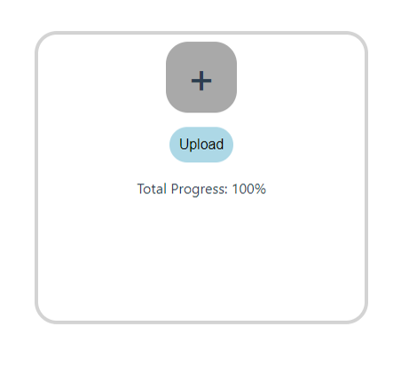
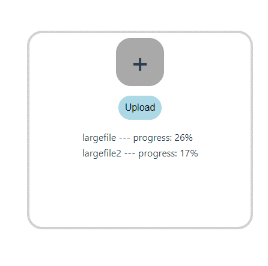
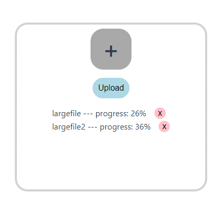
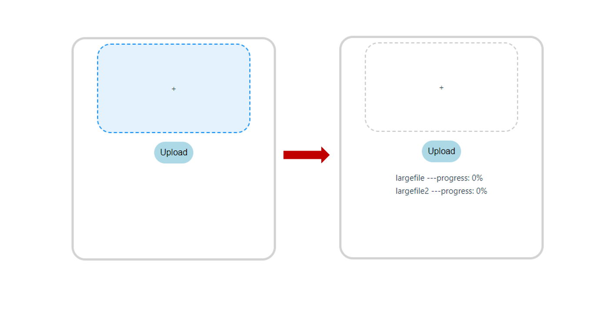

:::warning
實際上，在進度顯示為 100% 時，打開 dev-tool 可能會看到檔案依舊還在 POST。  
這是很正常的，畢竟我們身在純前端的環境，後端那邊接收了多少、做了哪些處理前端無法得知，所以這個上傳進度指的僅僅是檔案上傳到瀏覽器已經準備發出去的進度。  
坊間的各項 ui-framework 經測試也都是這個問題，所以有些前端工程師會故意把前端跑完的進度上限設為 95%，一直等到後端傳回 `response` 才一次跳到 100%，當然，這樣的進度比例就不準。  
如果要的是整個從 POST 到後端回應的進度，除了前端這邊設定外，也要使用 web-socket 來實時追蹤後端狀況。
:::
## 功能與解析
在不使用其他專門套件下，為上傳檔案添加上傳進度顯示。  
解法可以使用 axios 套件內部的 `onUploadProgress` 來直接處理上傳進度。
```js
axios.post('https://httpbin.org/post', formData, {
  // highlight-start
  onUploadProgress: (progressEvent) => {
    state.progress = Math.round((progressEvent.loaded * 100) / progressEvent.total)
  },
  // highlight-end
})
```

## 以 vue3 實作
:::info
實作套用的 api 為 [httpbin.org](https://httpbin.org/)，可以接受 POST 請求但不會實際儲存檔案。
:::
<details>
<summary>完整程式碼</summary>

```js
<script setup>
import axios from 'axios';
import { reactive } from 'vue';

const state = reactive({
  files: null,
  progress: 0,
  uploading: false,
})

const handleFileChange = (event) => {
  state.uploading = true
  state.files = event.target.files
}

const uploadFile = () => {
  if(!state.files){
    alert('No selected file!')
    return
  }else{
    const formData = new FormData()
    for(let i = 0; i < state.files.length; i++){
      formData.append(state.files[i].name, state.files[i])
    }
    // highlight-start
    // 檢查要 POST 的內容，詳看下述 warning
    for(let pair of formData.entries()) {
      console.log(pair[0]+', '+pair[1]);
    }
    // highlight-end

    axios.post('https://httpbin.org/post', formData, {
      // highlight-start
      onUploadProgress: (progressEvent) => {
        state.progress = Math.round((progressEvent.loaded * 100) / progressEvent.total)
      },
      // highlight-end
    })
    .then(() => {
      alert('All done!')
    })
    .catch((error) => {
      alert('Something error ><')
      console.log(error)
    })
    .finally(() => {
      state.files = null
      state.progress = 0
      state.uploading = false
    })
  }
}
</script>

<template>
    <div class="container">
      <label class="input-label">
        <input type="file" @change="handleFileChange" multiple/>
        <span>+</span>
      </label>
      <button @click="uploadFile">Upload</button>
      <div v-if="state.uploading" class="progress">
        <p>Total Progress: {{ state.progress }}%</p>
      </div>
    </div>
</template>

<style scoped lang="scss">
.container{
  display: flex;
  gap: 1rem;
  align-items: center;
  flex-direction: column;
  border: lightgray solid 0.25rem;
  border-radius: 25px;
  height: 40vh;
  width: 20vw;
  padding: 0.5rem;
}

.input-label{
  display: flex;
  align-items: center;
  justify-content: center;
  background-color: darkgray;
  width: 5rem;
  aspect-ratio: 1/1;
  border-radius: 25px;

  input{
    display: none;
  }
  span{
    font-size: 3rem;
    font-weight: 500;
    height: 5rem;
    aspect-ratio: 1/1;
    text-align: center;
  }
}

button{
  padding: 0.5rem;
  border: transparent solid;
  border-radius: 25px;
  background-color: lightblue;
  font-size: 1rem;
}

.progress{
  font-size: 1rem;
}
</style>
```
</details>

建立幾個大容量檔案來實際測試上傳進度的顯示，下述就是建立一個叫 largefile 的 50 mb 檔案：
```bash
dd if=/dev/urandom of=largefile bs=1M count=50
dd if=/dev/urandom of=largefile2 bs=1M count=75
```


:::warning
如果要檢查 POST 出去是否有內容，不能使用 `console.log(formData)`，會得到空物件，但實際上 `append` 是有運作的。
:::

## 實作每個檔案都有獨立進度顯示
因為 axios 的 onUploadProgress 顯示的是整個`全部的上傳進度`，如果今天是要一次上傳多個檔案，但要每個檔案有獨立的進度顯示會需要分開對每一個檔案做一次 POST。

實際上流程如下：
1. 使用者一次傳入多個檔案。
2. 前端賦予他們每個一個獨自的進度，並各自發送 POST。
```js
const handleFileChange = (event) => {
  state.uploading = true
  // 使用 Array.from 將 FileList 轉換為陣列，再將每個檔案包裝成包含進度的物件
  state.files = Array.from(event.target.files).map((file) => ({
    file,
    progress: 0,
  }))
}

const uploadFile = async (fileObj) => {
  const formData = new FormData()
  // 使用 append 把檔案塞進要 POST 的 formData
  formData.append(fileObj.file.name, fileObj.file)

  try {
    await axios.post('https://httpbin.org/post', formData, {
      onUploadProgress: (progressEvent) => {
        fileObj.progress = Math.round((progressEvent.loaded * 100) / progressEvent.total)
      },
    })
  } catch (error){
    console.log(error)
  }
}
```

<details>
<summary>完整程式碼</summary>

```js
<script setup>
import axios from 'axios';
import { reactive } from 'vue';

const state = reactive({
  // highlight-next-line
  files: [],
  uploading: false,
})

// 更改這裡
const handleFileChange = (event) => {
  state.uploading = true
  // highlight-start
  // 使用 Array.from 將 FileList 轉換為陣列，再將每個檔案包裝成包含進度的物件
  state.files = Array.from(event.target.files).map((file) => ({
    file,
    progress: 0,
  }))
  // highlight-end
}

// highlight-start
// 改成通用函式
const uploadFile = async (fileObj) => {
  const formData = new FormData()
  formData.append(fileObj.file.name, fileObj.file)
  // 檢查要 POST 的內容
  for(let pair of formData.entries()) {
    console.log(pair[0]+', '+pair[1]);
  }

  // 改成 try-catch
  try {
    await axios.post('https://httpbin.org/post', formData, {
      onUploadProgress: (progressEvent) => {
        // 記得改進度儲存位置
        fileObj.progress = Math.round((progressEvent.loaded * 100) / progressEvent.total)
      },
    })
  } catch (error){
    console.log(error)
  }
}
// highlight-end

// 一次上傳所有檔案
const upload = () => {
  if(!state.files){
    alert('No selected file!')
    return
  }else{
    const uploadPromises = state.files.map(uploadFile)
    Promise.allSettled(uploadPromises)
    .then(() => {
      alert('All done')
    })
    .catch((error) => {
      console.error(error)
      alert('Something error ><')
    })
    .finally(() => {
      state.uploading = false
      state.files = []
    })
  }
}
</script>

<template>
    <div class="container">
      <label class="input-label">
        <input type="file" @change="handleFileChange" multiple/>
        <span>+</span>
      </label>
      <!-- 修正引入函式 -->
      <button @click="upload">Upload</button>
      <div v-if="state.uploading" class="progress">
        <!-- 更改下列 -->
        <p v-for="fileObj in state.files" :key="fileObj.file.name">
          {{ fileObj.file.name }} --- progress: {{ fileObj.progress }}%
        </p>
      </div>
    </div>
</template>
```
</details>



### 取消單一檔案 POST 事件
使用 axios 提供的 `Cancel Token`。  
```js
const cancelTokenSource = axios.CancelToken.source()
await axios.post('https://httpbin.org/post', formData, {
  onUploadProgress: (progressEvent) => {
    fileObj.progress = Math.round((progressEvent.loaded * 100) / progressEvent.total)
  },
  // highlight-start
  // 添加第三個參數
  cancelToken: cancelTokenSource.token
  // highlight-end
})

// 取消函式可以綁在按鈕上
const cancelUpload = (fileObj) => cancelTokenSource.cancel('cancel upload')
```
下方完整 code，因為要獨立取消，所以每個檔案都要有自己的 Cancel Token。
<details>
<summary>完整程式碼</summary>

```js
<script setup>
import axios from 'axios';
import { reactive } from 'vue';

const state = reactive({
  files: [],
  uploading: false,
})

const handleFileChange = (event) => {
  state.uploading = true
  state.files = Array.from(event.target.files).map((file) => ({
    file,
    progress: 0,
    // highlight-start
    // 添加 cancel token
    cancelTokenSource: axios.CancelToken.source(),
    // highlight-end
  }))
}

// highlight-start
// 取消上傳函式
const cancelUpload = (fileObj) => {
  const fileIndex = state.files.findIndex((file) => file === fileObj);

  if (fileIndex !== -1) {
    // 取消檔案上傳請求
    state.files[fileIndex].cancelTokenSource.cancel('cancel upload')
  }
}
// highlight-end

const uploadFile = async (fileObj) => {
  const formData = new FormData()
  formData.append(fileObj.file.name, fileObj.file)
  for(let pair of formData.entries()) {
    console.log(pair[0]+', '+pair[1]);
  }

  try {
    await axios.post('https://httpbin.org/post', formData, {
      onUploadProgress: (progressEvent) => {
        fileObj.progress = Math.round((progressEvent.loaded * 100) / progressEvent.total)
      },
      // highlight-start
      // 添加第三個參數
      cancelToken: fileObj.cancelTokenSource.token
      // highlight-end
    })
  } catch (error){
    console.log(error)
  }
}

const upload = () => {
  if(state.files.length === 0){
    alert('No selected file!')
    return
  }else{
    const uploadPromises = state.files.map(uploadFile)
    Promise.allSettled(uploadPromises)
    .then(() => {
      alert('All done')
    })
    .catch((error) => {
      console.error(error)
      alert('Something error ><')
    })
    .finally(() => {
      state.uploading = false
      state.files = []
    })
  }
}
</script>

<template>
    <div class="container">
      <label class="input-label">
        <input type="file" @change="handleFileChange" multiple/>
        <span>+</span>
      </label>
      <button @click="upload">Upload</button>
      <div v-if="state.uploading" class="progress">
        <!-- 更改下列 -->
        <div v-for="fileObj in state.files" :key="fileObj.file.name" class="file-description">
          <p>
            {{ fileObj.file.name }} --- progress: {{ fileObj.progress }}%
          </p>
          <button @click="() => cancelUpload(fileObj)" class="cancel">
            x
          </button>
        </div>
      </div>
    </div>
</template>

<style scoped lang="scss">
.file-description{
  display: flex;
  gap: 1rem;
  align-items: center;
}
.cancel{
  width: 1rem;
  height: 1rem;
  border-radius: 50%;
  padding: 0.5rem;
  background-color: pink;
  display: flex;
  align-items: center;
  justify-content: center;
}
</style>
```
</details>




可以從開發者工具中觀察到 POST 請求被取消：


## 拖曳式上傳資料
拖曳式上傳不使用 HTML 的 `<input>` 來放入檔案，而是使用 `Drag & Drop api` 來實現檔案的上傳。  
拖曳時會觸發：  
1. `dragenter`：拖曳進入元素範圍時觸發。
2. `dragover`：持續在元素上拖曳時觸發。
3. `dragleave`：拖曳離開元素時觸發。
4. `drop`：放下拖曳的元素 (檔案) 時觸發。
```js title='<script setup>'
const handleIsDrag = () => {
    state.isDragOver = true
}

const handleDrop = (event) => {
    state.isDragOver = false
    state.uploading = true
    const files = Array.from(event.dataTransfer.files).map((file) => ({
    file,
    progress: 0,
    }));

    // 將文件添加到 state.files 中
    state.files = files
}
```
```html title='HTML structure'
<div
  @dragenter.prevent="handleIsDrag"
  @dragover.prevent="handleIsDrag"
  @dragleave.prevent="handleIsDrag"
  @drop.prevent="handleDrop"
  class="drop-area"
  :class="{ 'drag-over': state.isDragOver }"
  >
</div>
```

<details>
<summary>完整程式碼</summary>

```js
<script setup>
import axios from 'axios';
import { reactive } from 'vue';

const state = reactive({
    files: [],
    uploading: false,
    isDragOver: false,
})

const uploadFile = async (fileObj) => {
    const formData = new FormData()
    formData.append(fileObj.file.name, fileObj.file)
    // 檢查要 POST 的內容
    for(let pair of formData.entries()) {
      console.log(pair[0]+', '+pair[1]);
    }

    try {
    await axios.post('https://httpbin.org/post', formData, {
        onUploadProgress: (progressEvent) => {
        fileObj.progress = Math.round((progressEvent.loaded * 100) / progressEvent.total);
        },
    })
    } catch (error) {
    console.error('Upload error', error);
    }
}

const uploadFiles = () => {
    const uploadPromises = state.files.map(uploadFile)
    Promise.all(uploadPromises)
    .then(() => {
        alert('All done')
    })
    .catch((error) => {
        console.error(error)
        alert('Something error ><')
    })
    .finally(() => {
        state.uploading = false
        state.files = []
    })
}
// highlight-start
// drag and drop
const handleIsDrag = () => {
    state.isDragOver = true
}

const handleDrop = (event) => {
    state.isDragOver = false
    state.uploading = true
    const files = Array.from(event.dataTransfer.files).map((file) => ({
    file,
    progress: 0,
    }));

    // 將文件添加到 state.files 中
    state.files = files
}
// highlight-end
</script>

<template>
    <div class="container">
      <div
        @dragenter.prevent="handleIsDrag"
        @dragover.prevent="handleIsDrag"
        @dragleave.prevent="handleIsDrag"
        @drop.prevent="handleDrop"
        class="drop-area"
        :class="{ 'drag-over': state.isDragOver }"
        >
        <span>+</span>
      </div>
      <button @click="uploadFiles">Upload</button>
      <div v-if="state.uploading">
        <div v-for="(fileObj, index) in state.files" :key="index">
          <p>{{ fileObj.file.name }} ---progress: {{ fileObj.progress }}%</p>
        </div>
      </div>
    </div>
</template>

<style scoped>
.container{
  display: flex;
  gap: 1rem;
  align-items: center;
  flex-direction: column;
  border: lightgray solid 0.25rem;
  border-radius: 25px;
  height: 50vh;
  width: 20vw;
  padding: 0.5rem;
}

.drop-area {
  width: 15vw;
  height: 20vh;
  border: 2px dashed #ccc;
  border-radius: 25px;
  padding: 1.25rem;
  display: flex;
  align-items: center;
  justify-content: center;
}

.drag-over {
  border-color: #2196F3;
  background-color: #E3F2FD;
}

button{
  padding: 0.5rem;
  border: transparent solid;
  border-radius: 25px;
  background-color: lightblue;
  font-size: 1rem;
}
</style>
```
</details>



## 進階綜合實作
:::tip
此實作以 [Vuetify](https://vuetifyjs.com/zh-Hans/) 作為 UI framework，目的很單純，只是為了進度條的渲染。
:::
1. 可以點擊選擇檔案，也可以拖曳選擇檔案。
2. 可以取消上傳。
3. 每次 POST 請求只有 5 個，一個執行完畢就立馬遞補一個檔案進來上傳。
```js
const uploadFiles = async () => {
    if (state.files.length === 0) {
      alert('No selected file!')
      return
    }

    const maxConcurrentUploads = 5
    let currentIndex = 0
    let completedUploads = 0

    const uploadFileAndNext = async (file) => {
      try {
        await uploadFile(file);
      } catch (error) {
        console.error(error);
        // 上傳失敗時的處理邏輯
      } finally {
        // 無論上傳成功或失敗，都增加已完成的上傳數
        completedUploads++;

        // 當上傳結束後，遞補新的檔案進行 POST
        if (currentIndex < state.files.length) {
          const nextFile = state.files[currentIndex++];
          uploadFileAndNext(nextFile)
        }

        // 如果所有檔案都已上傳完成，顯示提示
        if (completedUploads === state.files.length) {
          alert('All done')
          state.uploading = false
          state.files = []
        }
      }
    }

    // 初始化同時運行的 POST
    const uploadPromises = []
    for (let i = 0; i < maxConcurrentUploads && i < state.files.length; i++) {
      const file = state.files[currentIndex++]
      uploadPromises.push(uploadFileAndNext(file))
    }

    // 等待所有 POST 完成
    await Promise.all(uploadPromises)
}
```
4. 前端上傳完成後只在網頁顯示 95%，一直到 response 回來才跳 100%。
```js
const uploadFile = async (fileObj) => {
    const formData = new FormData()
    formData.append(fileObj.file.name, fileObj.file)
    for(let pair of formData.entries()) {
      console.log(pair[0]+', '+pair[1]);
    }
    // highlight-next-line
    let response

    try {
      console.time('axios:')
      response = await axios.post('https://httpbin.org/post', formData, {
          onUploadProgress: (progressEvent) => {
            const loaded = progressEvent.loaded
            const total = progressEvent.total
            // highlight-next-line
            const uploadPercentage = response ? 100 : Math.round((loaded * 95) / total)
            fileObj.progress = uploadPercentage
          },
          cancelToken: fileObj.cancelTokenSource.token
      })
      console.timeEnd('axios:')
      // highlight-next-line
      fileObj.progress = 100
    } catch (error) {
    console.error('Upload error', error);
    }
}
```

<details>
<summary>完整程式碼</summary>

```js
<script setup>
import axios from 'axios';
import { reactive } from 'vue';

const state = reactive({
    files: [],
    uploading: false,
    isDragOver: false,
})

// imput file
const handleFileChange = (event) => {
  state.uploading = true
  state.files = Array.from(event.target.files).map((file) => ({
    file,
    progress: 0,
    cancelTokenSource: axios.CancelToken.source(),
  }))
}

// drag and drop
const handleIsDrag = () => {
    state.isDragOver = true
}

const handleDrop = (event) => {
    state.isDragOver = false
    state.uploading = true
    const files = Array.from(event.dataTransfer.files).map((file) => ({
    file,
    progress: 0,
    cancelTokenSource: axios.CancelToken.source(),
    }));

    state.files = files
}

// cancel upload
const cancelUpload = (fileObj) => {
  const fileIndex = state.files.findIndex((file) => file === fileObj);

  if (fileIndex !== -1) {
    state.files[fileIndex].cancelTokenSource.cancel('cancel upload')
  }
}

// upload
const uploadFile = async (fileObj) => {
    const formData = new FormData()
    formData.append(fileObj.file.name, fileObj.file)
    for(let pair of formData.entries()) {
      console.log(pair[0]+', '+pair[1]);
    }
    let response

    try {
      console.time('axios:')
      response = await axios.post('https://httpbin.org/post', formData, {
          onUploadProgress: (progressEvent) => {
            const loaded = progressEvent.loaded
            const total = progressEvent.total
            const uploadPercentage = response ? 100 : Math.round((loaded * 95) / total)
            fileObj.progress = uploadPercentage
          },
          cancelToken: fileObj.cancelTokenSource.token
      })
      console.timeEnd('axios:')
      fileObj.progress = 100
    } catch (error) {
    console.error('Upload error', error);
    }
}

const uploadFiles = async () => {
    if (state.files.length === 0) {
      alert('No selected file!')
      return
    }

    const maxConcurrentUploads = 5
    let currentIndex = 0
    let completedUploads = 0

    const uploadFileAndNext = async (file) => {
      try {
        await uploadFile(file);
      } catch (error) {
        console.error(error);
        // 上傳失敗時的處理邏輯
      } finally {
        // 無論上傳成功或失敗，都增加已完成的上傳數
        completedUploads++;

        // 當上傳結束後，遞補新的檔案進行 POST
        if (currentIndex < state.files.length) {
          const nextFile = state.files[currentIndex++];
          uploadFileAndNext(nextFile)
        }

        // 如果所有檔案都已上傳完成，顯示提示
        if (completedUploads === state.files.length) {
          alert('All done')
          state.uploading = false
          state.files = []
        }
      }
    }

    // 初始化同時運行的 POST
    const uploadPromises = []
    for (let i = 0; i < maxConcurrentUploads && i < state.files.length; i++) {
      const file = state.files[currentIndex++]
      uploadPromises.push(uploadFileAndNext(file))
    }

    // 等待所有 POST 完成
    await Promise.all(uploadPromises)
}
</script>

<template>
    <div class="container">
      <div
        @dragenter.prevent="handleIsDrag"
        @dragover.prevent="handleIsDrag"
        @dragleave.prevent="handleIsDrag"
        @drop.prevent="handleDrop"
        class="drop-area"
        :class="{ 'drag-over': state.isDragOver }"
        >
        <label class="input-label">
          <input type="file" @change="handleFileChange" multiple/>
          <span>+</span>
        </label>
      </div>
      <button @click="uploadFiles">Upload</button>
      <div v-if="state.uploading">
        <div v-for="(fileObj, index) in state.files" :key="index" class="progress">
          <p>{{ fileObj.file.name }}</p>
          <v-progress-linear
            rounded
            color="primary" 
            v-model="fileObj.progress"
            height="25px"
            class="linebar">
            <strong>{{ Math.ceil(fileObj.progress) }}%</strong>
          </v-progress-linear>
          <button @click="() => cancelUpload(fileObj)" class="cancel">
            Cancel
          </button>
        </div>
      </div>
    </div>
</template>

<style scoped>
.container{
  display: flex;
  gap: 1rem;
  align-items: center;
  flex-direction: column;
  border-radius: 25px;
  height: 80vh;
  width: 100%;
  padding: 1rem;
}

.drop-area {
  width: 15vw;
  height: 20vh;
  border: 2px dashed #ccc;
  border-radius: 25px;
  display: flex;
  align-items: center;
  justify-content: center;
}

.drag-over {
  border-color: #2196F3;
  background-color: #E3F2FD;
}

.input-label{
  display: flex;
  align-items: center;
  justify-content: center;
  background-color: rgba(225, 225, 225, 0.6);
  width: 100%;
  height: 100%;
  border-radius: 25px;
  cursor: pointer;

  input{
    display: none;
  }
  span{
    font-size: 3rem;
    font-weight: 500;
  }
}

button{
  padding: 0.5rem;
  border-radius: 25px;
  background-color: lightblue;
  font-size: 1rem;
}

.progress{
  width: 45vw;
  margin-top: 1rem;
  display: grid;
  gap: 1.5rem;
  grid-template-rows: 1fr;
  grid-template-columns: 1fr 3fr 1fr;

  p{
    grid-column: 1/2;
    align-self: center;
  }
  .linebar{
    grid-column: 2/3;
    align-self: center;
  }
}

.cancel{
  width: 60%;
  border-radius: 25px;
  padding: 0.5rem;
  background-color: pink;
  display: flex;
  align-items: center;
  justify-content: center;
  grid-column: 3/4;
  align-self: center;
  justify-self: end;
}
</style>
```
</details>
<details>
<summary>一次建立多個測試檔案</summary>

1. 建立一個 `generate_file.sh` 文件，貼上下列指令：
```bash
#!/bin/bash

# 設定要生成的檔案數量
num_files=20

# 設定檔案大小的範圍（以 MB 為單位）
min_size=10
max_size=30

# 生成檔案
for ((i=1; i<=$num_files; i++)); do
  # 隨機決定檔案大小
  file_size=$(shuf -i $min_size-$max_size -n 1)
  # 生成檔案內容
  file_content=$(dd if=/dev/urandom of="file_${i}_${file_size}MB.txt" bs=1M count=$file_size status=none)
  echo "Generated: file_${i}_${file_size}MB.txt"
done
```
2. 終端機執行：
```bash
bash generate_file.sh
```
</details>


## 參考資料
1. [使用Axios中的onUploadProgress实现显示文件上传进度](https://blog.csdn.net/qq_41915137/article/details/132607010)
2. [Formdata object shows empty even after calling append](https://stackoverflow.com/questions/37235810/formdata-object-shows-empty-even-after-calling-append)