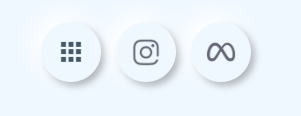

:::info
[植宇宙工作室形象網站](https://plantae-taiwan.vercel.app/)
:::
## 概述
- 版本：v1.1
- 版本重點：網站形象重新設計、初步建立購物車功能。
- 開發系統：Nuxt3 全端開發，資料庫採 Vercel Postgres。
- 路由架構：

```xml
---| /index 主頁
------| /shop 植宇宙雜貨店
------| /cart 購物車
------| /info 訂單查詢
------| /article 植宇宙手札
------| 管理後台
```

## 設計與功能
:::tip
此專案樣式涉及 Tailwind CSS、Scss、Vuitify，主要是先利用 Tailwind CSS 跟 Vuitify 這個框架編出網站整體架構，再透過 Scss 微調。
:::
### 首頁粒子特效
粒子特效參考[**Day 29 鐵人賽太空粒子的例子**](https://ithelp.ithome.com.tw/articles/10339244?sc=rss.iron)這篇文章。  
這篇文章採用 `box-shadow` 來製作粒子從螢幕下方向上飛起的動畫特效，原文採用純 css 寫法，因此寫了上千個 `box-shadow` 設定，那個 css 程式碼長度真的很常很長很長...因此到我手上改成使用 TypeScript 來隨機產生 700 個點。

```xml
<script setup lang="ts">
const numShadows = 700

const generateParticle = (numShadows: number): string => {
  let boxShadowValue = ''

  for (let i = 0; i < numShadows; i++) {
    boxShadowValue += `${Math.random() * 2000}px ${Math.random() * 2000}px #4f6036, `
  }

  // 移除最後一個逗號和空格
  boxShadowValue = boxShadowValue.slice(0, -2)

  return boxShadowValue
}

onMounted(() => {
  const boxShadow = generateParticle(numShadows)
  const div = document.querySelector('.particle') as HTMLElement
  div.style.boxShadow = boxShadow
})
</script>

<template>
    <!-- 浮動粒子 -->
    <div class="particle rounded-full bg-transparent"></div>
</template>

<style scoped lang="scss">
.particle {
  width: 1.5px;
  height: 1.5px;
  animation: anim-star 100s linear infinite;
}

@keyframes anim-star {
  from {
    transform: translateY(0);
  }

  to {
    transform: translateY(-2000px);
  }
}
</style>
```

### 浮雕效果
使用 `box-shadow` 可以製作出浮雕效果，主要就是利用陰影來營造立體的感覺，但我覺得這有一點點考驗個人美學與物理學的感覺，要稍微透過想像力去想光要從哪裡打、產生怎樣的陰影，才能做出服掉的立體感。

```xml
<template>
<button
    v-show="isMenuOpen"
    class="btn btn-menu size-12 rounded-full"
    data-content="主頁"
    @click="resetMenuOpen"
>
    <v-icon icon="mdi-home" :color="getIconColor('/')" />
</button>
</template>

<style scoped lang="scss">
.emboss {
  box-shadow:
    -6px -6px 16px rgb(255 255 255),
    3px 3px 6px rgb(0 0 0 / 30%);
}

.btn {
  @apply emboss relative flex items-center justify-center;
}
</style>
```



### logo 遮罩效果
遮罩的效果實現是採用 CSS 原生的 `mask` 語法，邏輯是先給予一張背景圖片，再透過 `mask` 把另一張圖片放上去做遮罩，注意這裡只能使用 svg 或 png 檔。

```xml
<template>
<div class="index-mask flex items-center justify-center rounded-full outline"></div>
</template>

<style scoped lang="scss">
.index-mask {
  background: url('@/assets/images/index.jpg') no-repeat top center;
  background-size: cover;
  -webkit-mask: url('@/assets/logo.png') no-repeat center center;
  mask: url('@/assets/logo.png') no-repeat center center;
  -webkit-mask-size: contain;
  mask-size: contain;
  width: 16rem;
  height: 16rem;
}
</style>
```


### RWD 斷點
因為在大架構上採用 Vuetify 的 `v-row` 跟 `v-col` 可以迅速製作 RWD 格式，因此在其他部分微調時參照的斷點也以 Vuetify 為主。

| 名稱                      | 縮寫 | 範圍                  |
|---------------------------|-----|-----------------------|
| 超小號 (Extra small)       | xs  | 小型到大型的手機       | < 600px                |
| 小號 (Small)              | sm  | 小型到中型的平板       | 600px > < 960px        |
| 中號 (Medium)             | md  | 大型平板到筆記型電腦   | 960px > < 1280px       |
| 大號 (Large)              | lg  | 從筆記型電腦到桌上型電腦 | 1280px > < 1920px      |
| 超大號 (Extra large)      | xl  | 分辨率 1080p 到 1440p 的桌上型電腦 | 1920px > < 2560px |
| 超大號 (Extra extra large)| xxl | 4K 和超寬屏幕           | > 2560px               |

:::warning
`v-col` 中的 `cols` 其實就是 `xs`，詳情參閱 [**Breakpoints not working correctly for xs in vuetify**](https://stackoverflow.com/questions/59255192/breakpoints-not-working-correctly-for-xs-in-vuetify)。
:::

### 資料庫設計
1.1 版的資料庫只需要儲存訂單相關資訊，依資料庫正規化格式，資料表設計如下：

#### Users Table
| Column     | Type         | Constraints          | Description                        |
|------------|--------------|----------------------|------------------------------------|
| id         | SERIAL       | PRIMARY KEY          | 唯一標識符，自動生成序列號            |
| name       | VARCHAR(50)  | NOT NULL             | 用戶名                             |
| address    | VARCHAR(255) | NOT NULL             | 用戶地址                           |
| phone      | VARCHAR(20)  | NOT NULL             | 用戶電話號碼                       |
| card_number| VARCHAR(255)  | NOT NULL             | 匯款帳號                         |

#### Products Table
| Column      | Type         | Constraints | Description                    |
|-------------|--------------|-------------|--------------------------------|
| id          | SERIAL       | PRIMARY KEY | 唯一標識符，自動生成序列號        |
| name        | VARCHAR(255) | NOT NULL    | 產品名稱                         |
| unit        | VARCHAR(50)  | NOT NULL    | 產品單位                         |
| price       | NUMERIC      | NOT NULL    | 產品價格                         |

#### Delivery Table
| Column      | Type         | Constraints | Description                    |
|-------------|--------------|-------------|--------------------------------|
| id          | SERIAL       | PRIMARY KEY | 唯一標識符，自動生成序列號        |
| name        | VARCHAR(255) | NOT NULL    | 運送方式名稱                      |
| cost        | INTEGER      | NOT NULL    | 運送費用                         |

#### Orders Table
| Column          | Type          | Constraints                         | Description                        |
|-----------------|---------------|-------------------------------------|------------------------------------|
| id              | SERIAL        | PRIMARY KEY                         | 唯一標識符，自動生成序列號            |
| users_id        | INTEGER       | NOT NULL REFERENCES users(id)       | 關聯用戶ID                         |
| delivery_id     | INTEGER       | NOT NULL REFERENCES delivery(id)    | 關聯運送方式ID                      |
| order_id        | VARCHAR(20)   | NOT NULL                            | 訂單編號                           |
| total_price     | INTEGER       | NOT NULL                            | 總價                              |
| status          | VARCHAR(20)   | NOT NULL DEFAULT '訂單處理中'        | 訂單狀態                           |
| delivery_time   | TIMESTAMP     | DEFAULT '尚未寄送'                   | 寄出時間                       |
| tracking_number | VARCHAR(20)   | DEFAULT '未有貨運單號'               | 物流追蹤編號                       |
| note            | TEXT          |                                     | 訂單備註                           |
| created_at      | TIMESTAMP     | DEFAULT CURRENT_TIMESTAMP           | 創建時間                           |

#### Order Details Table
| Column      | Type          | Constraints                        | Description                   |
|-------------|---------------|------------------------------------|-------------------------------|
| id          | SERIAL        | PRIMARY KEY                        | 唯一標識符，自動生成序列號       |
| order_id    | INTEGER       | NOT NULL REFERENCES orders(id)     | 關聯訂單ID                     |
| product_id  | INTEGER       | NOT NULL REFERENCES products(id)   | 關聯產品ID                     |
| quantity    | INTEGER       | NOT NULL                           | 訂購數量                       |
| price       | NUMERIC       | NOT NULL                           | 單品價格                       |


