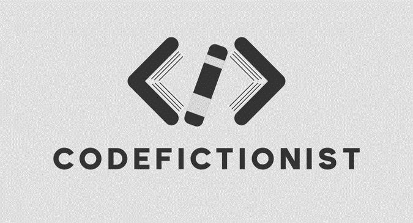

## CodeFictionist
#### Code + Fictionist = 寫程式的小說家。  
第一個是我現在的職業內容，第二個是我的夢想頭銜。  
所以為這個網站命名為 CodeFictionist
，顧名思義就是為了寫些技術筆記以及放我寫的小說。

#### 為什麼要特意架站寫文章？
楊斯棓醫師在`人生路引`中寫道：
> 世間的問題，以前的人都遇過，而遇過的人當中，有些人寫成書分享他的解法。我們很幸運的，可以從書中找答案，不必用肉身撞得頭破血流。

陳立飛先生的著作，`寫作是最好的自我投資`，也說過寫作是經營自我品牌有效的方法。

而我很貪心，也好為人師，在記筆記時也想經營自己的前端工程師身分，所以我決定架個網站把它們展示出來

#### 怎麼會有小說？
有小說 !? 哪裡有小說 !?  
誒好啦，沒意外的話這裡應該會有小說，我架站的原因之一也是我沒膽量把小說放到那種大流量的網站。

為何寫小說？這是個很有趣的問題。  
我小學和國中就和朋友幹過那種交換輪流寫小說的事情。  
我喜歡打遊戲、喜歡看小說，每次投入在其中都會幻想自己若身在那樣一個世界可以幹嘛幹嘛之類的。  
我也曾經想過，如果作家死掉，會轉生到他曾經筆下的世界生活嗎 (什麼輕小說劇情 :unamused:)？  
總而言之，寫小說就只是為了型塑我自己腦海中的一個幻想世界。

我有個朋友有篇 IG 文令我印象深刻，大意是這樣的：男孩子的前兩個職業夢想是電競選手跟工程師，他剛好都滿足了。  
我是無法當電競選手啦，但我可以當個奇幻寫手。

***
## 關於我
嗨，我是 Jeremy，一名菜鳥前端工程師。  
我鑽研了六年的農業研究，一路讀到 112 大學農藝所，誰知道現在幹著與以前專業八竿子打不著的工作 (笑)。

坦白說我也沒想過有一天我會靠寫網頁維生，早知道高中就不要因為討厭數學而跑去選三類，看看台灣這幾年二類多稱霸天下。

我也不確定我未來對這份工作的熱忱會有多少，但最起碼，我現在有在寫 code 的時候都覺得上班時間特別快，這是件好事！  
總而言之，只要我還在寫 code，CodeFictionist 的 Code 就不會換成其他詞！(還是其實大家想看的是 AgriFictionist :no_mouth:)

