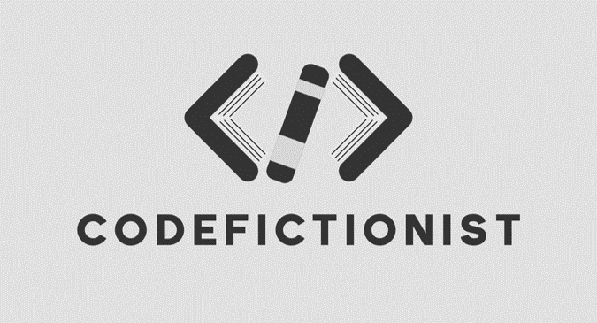

## 前言
嗨，歡迎來到 **CodeFictionist**，我是 Jeremy，一名菜鳥前端工程師。  
CodeFictionist 這個網站是我在拿到第一份前端工作後架設的，那時剛拿到 offer 就覺得我應該自己架一個網站拿來寫些東西，所以就有了這個網站。  

坦白說我就是那個 Dcard 大家常說的轉職仔:sweat_smile:。  
我鑽研了六年的農業研究，一路讀到 112 大學農藝所，心裡曾經以為自己將會成為一個作物育種家，誰知道現在幹著與以前專業八竿子打不著的工作 (笑)。  
說實在的，我也沒想過有一天我會靠寫網頁維生，早知道高中就不要因為討厭數學而跑去選三類，看看台灣這幾年二類多稱霸天下:grimacing:。

***

## 個人經歷

***

## 點得很奇妙的技能樹

***

## About CodeFictionist
### 寫程式的小說家
本來取這個名字是期待自己有一天能跟人這樣自我介紹：我，Jeremy，一名寫程式的小說家。  
但是我從這個網站創立到現在，連第一章都生不出來，所以我決定換個角度來看這個名字：  

> 我，Jeremy，一名把 code 當小說寫的工程師。

畢竟，有時沉浸在一堆 bug 中通靈也是挺魔幻的，跟寫小說差不多對吧 :smiley:  
好啦，總有一天還是希望我把小說寫出來啦，畢竟我連專門放小說的 docusaurus 都先建好了。

### 為什麼寫文章？
我很想引用楊斯棓醫師在`人生路引`中寫的：

> 世間的問題，以前的人都遇過，而遇過的人當中，有些人寫成書分享他的解法。我們很幸運的，可以從書中找答案，不必用肉身撞得頭破血流。

但事實上我建一個網站寫文章的根本只是希望如果我到了一個新環境或是用了不是自己的電腦，想要看一些自己的筆記時只要輸入短短一串網址就能看到我那些筆記，還不用打帳號密碼，多方便啊。

***

## 關於 Logo
特地提出來講一下這個 Logo，本來我是要請設計師朋朋幫我設計，但我在自己亂摸索 Logo 設計時找到 [Brand Crowd](https://www.brandcrowd.com/) 這個網站，我只是把我的網站名稱跟元素丟給它，他們的 AI 就幫我設計出這個 Logo 了。  

整體而言，我第一眼看到這個 Logo 時，就俗話說的，一見鍾情。  
用書籍組成 `</>` 的符號，這 idea 實在太妙了，當下立馬信用卡刷下去，把這個 Logo 正式拿下當作個人與網頁的標誌。

